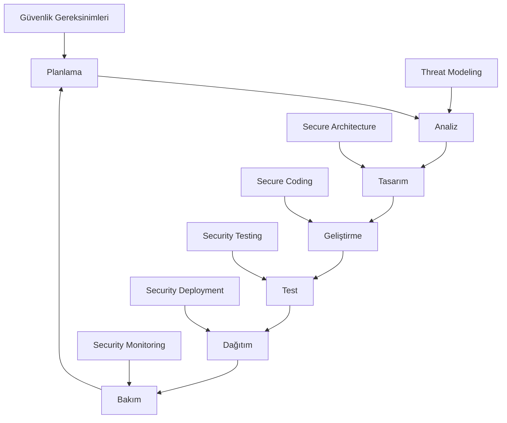
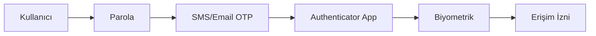
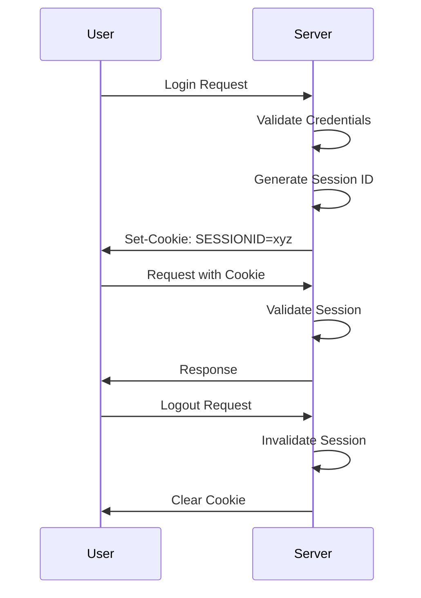

# 🛡️ Seviye 1 - Uygulama Güvenliği Temelleri

## 🎯 Seviye Hedefi

Bu bölümde, uygulama güvenliğinin temel kavramlarını, yaygın zafiyetleri ve güvenli yazılım geliştirme pratiklerini öğreneceksiniz. Amaç, web uygulamalarındaki güvenlik açıklarını anlama, tespit etme ve önleme konularında temel bir anlayış oluşturmaktır. Bu bilgiler, güvenli yazılım geliştirme ve uygulama güvenlik testleri için gerekli temel becerileri sağlar.

## 📚 Konu Başlıkları

1. [Uygulama Güvenliğine Giriş](#1-uygulama-güvenliğine-giriş)
2. [Yaygın Uygulama Zafiyetleri (OWASP Top 10)](#2-yaygın-uygulama-zafiyetleri-owasp-top-10)
3. [Güvenli Yazılım Geliştirme Yaşam Döngüsü (SSDLC)](#3-güvenli-yazılım-geliştirme-yaşam-döngüsü-ssdlc)
4. [Temel Test Metodolojileri](#4-temel-test-metodolojileri)
5. [Kimlik Doğrulama ve Yetkilendirme Temelleri](#5-kimlik-doğrulama-ve-yetkilendirme-temelleri)
6. [Oturum Yönetimi Güvenliği](#6-oturum-yönetimi-güvenliği)
7. [Girdi Doğrulama ve Çıktı Kodlama](#7-girdi-doğrulama-ve-çıktı-kodlama)
8. [Uygulama Güvenliği Araçları](#8-uygulama-güvenliği-araçları)
9. [En İyi Uygulamalar ve Kaynaklar](#9-en-iyi-uygulamalar-ve-kaynaklar)

---

## 1. Uygulama Güvenliğine Giriş

Uygulama güvenliği, yazılım uygulamalarının tasarım, geliştirme, dağıtım ve bakım aşamalarında güvenlik açıklarının önlenmesi, tespit edilmesi ve giderilmesi sürecidir.

### Neden Önemlidir?

- **Veri Koruma:** Hassas kullanıcı ve iş verilerinin korunması
- **İş Sürekliliği:** Güvenlik ihlallerinin iş operasyonlarını durdurmasının önlenmesi
- **Yasal Uyumluluk:** GDPR, HIPAA, PCI DSS gibi düzenlemelere uyum
- **İtibar Yönetimi:** Güvenlik ihlallerinin marka itibarına verdiği zararın önlenmesi
- **Mali Koruma:** Güvenlik ihlallerinin mali kayıplarının minimize edilmesi

### Uygulama Güvenliği Kapsamı

- **Web Uygulamaları:** Browser tabanlı uygulamalar
- **Mobil Uygulamalar:** iOS, Android uygulamaları
- **API'ler:** REST, SOAP, GraphQL servisleri
- **Masaüstü Uygulamaları:** Desktop yazılımları
- **IoT Uygulamaları:** Nesnelerin interneti cihazları

### Güvenlik Açığı vs Tehdit vs Risk

- **Güvenlik Açığı (Vulnerability):** Sistemdeki zayıflık veya hata
- **Tehdit (Threat):** Güvenlik açığını sömürme potansiyeli
- **Risk:** Tehdidin gerçekleşme olasılığı ve etkisi

---

## 2. Yaygın Uygulama Zafiyetleri (OWASP Top 10)

OWASP Top 10, web uygulamalarındaki en kritik güvenlik risklerinin bir listesidir. Bu riskleri anlamak, güvenli uygulamalar geliştirmek için temel bir adımdır.

### A01:2021 – Bozuk Erişim Kontrolü (Broken Access Control)

**Açıklama:** Kullanıcıların yetkileri dışındaki işlevlere veya verilere erişebilmesi durumudur.

**Yaygın Örnekler:**
- URL manipülasyonu ile başka kullanıcının verilerine erişim
- Yetki yükseltme (privilege escalation)
- CORS (Cross-Origin Resource Sharing) yanlış yapılandırması
- Metadata manipülasyonu (JWT token değiştirme)

**Önlemler:**
- Rol tabanlı erişim kontrolü (RBAC) uygulamak
- Varsayılan olarak erişimi reddetmek (deny-by-default)
- Tüm erişim isteklerini sunucu tarafında doğrulamak
- Minimum yetki prensibini uygulamak

**Test Yöntemleri:**
```bash
# URL manipülasyonu testi
curl -X GET "https://example.com/user/123/profile" -H "Authorization: Bearer [token]"
curl -X GET "https://example.com/user/124/profile" -H "Authorization: Bearer [token]"

# HTTP metot manipülasyonu
curl -X POST "https://example.com/admin/users" -H "Authorization: Bearer [user_token]"
```

### A02:2021 – Kriptografik Hatalar (Cryptographic Failures)

**Açıklama:** Hassas verilerin düzgün şifrelenmemesi veya zayıf kriptografik algoritmaların kullanılması.

**Yaygın Örnekler:**
- Düz metin parola saklama
- Zayıf hash algoritmaları (MD5, SHA1)
- Yetersiz TLS yapılandırması
- Zayıf rastgele sayı üretimi

**Önlemler:**
- Güçlü şifreleme algoritmaları (AES-256, RSA-2048+)
- Güvenli hash fonksiyonları (bcrypt, scrypt, Argon2)
- TLS 1.2+ kullanımı
- Proper key management

**Test Yöntemleri:**
```bash
# TLS yapılandırması testi
sslyze --regular example.com

# Zayıf cipher suite testi
nmap --script ssl-enum-ciphers -p 443 example.com
```

### A03:2021 – Enjeksiyon (Injection)

**Açıklama:** Güvenilmeyen verilerin komut veya sorgu parçası olarak yorumlanması.

**Türleri:**
- **SQL Injection:** Veritabanı sorgularına zararlı kod enjeksiyonu
- **NoSQL Injection:** NoSQL veritabanlarına yönelik enjeksiyon
- **LDAP Injection:** LDAP sorgularına enjeksiyon
- **OS Command Injection:** İşletim sistemi komutlarına enjeksiyon
- **XPath Injection:** XML sorgularına enjeksiyon

**SQL Injection Örneği:**
```sql
-- Zafiyetli kod
SELECT * FROM users WHERE username = '$username' AND password = '$password'

-- Saldırı
username: admin'--
password: anything

-- Sonuç sorgu
SELECT * FROM users WHERE username = 'admin'--' AND password = 'anything'
```

**Önlemler:**
- Parametreli sorgular (Prepared Statements)
- Stored procedures kullanımı
- Input validation ve sanitization
- En az yetki prensibi
- WAF (Web Application Firewall) kullanımı

**Test Yöntemleri:**
```bash
# SQLMap ile SQL injection testi
sqlmap -u "http://example.com/login.php" --data="username=test&password=test" --dbs

# Manuel test
curl -X POST "http://example.com/login" -d "username=admin'OR'1'='1&password=test"
```

### A04:2021 – Güvensiz Tasarım (Insecure Design)

**Açıklama:** Tasarım aşamasında güvenlik prensiplerinin göz ardı edilmesi.

**Örnekler:**
- Tehdit modellemesinin yapılmaması
- Güvenlik gereksinimlerinin tanımlanmaması
- Güvenli tasarım desenlerinin kullanılmaması

**Önlemler:**
- Threat modeling yapma
- Security by design prensibi
- Güvenlik gereksinimlerini erken tanımlama
- Secure coding standards

### A05:2021 – Güvenlik Yanlış Yapılandırması (Security Misconfiguration)

**Açıklama:** Güvenlik ayarlarının varsayılan veya güvensiz değerlerde bırakılması.

**Örnekler:**
- Varsayılan parolaların değiştirilmemesi
- Gereksiz servislerin açık bırakılması
- Hata mesajlarında hassas bilgi sızıntısı
- CORS politikalarının yanlış yapılandırılması

**Önlemler:**
- Security hardening checklist kullanma
- Automated security scanning
- Minimal installation prensibi
- Regular security updates

### A06:2021 – Zafiyetli ve Güncel Olmayan Bileşenler

**Açıklama:** Bilinen güvenlik açıkları olan kütüphanelerin kullanılması.

**Önlemler:**
- Dependency scanning tools
- Regular updates
- Vulnerability databases monitoring
- Software composition analysis (SCA)

**Araçlar:**
```bash
# NPM audit
npm audit

# OWASP Dependency Check
dependency-check --project "MyProject" --scan .

# Snyk
snyk test
```

### A07:2021 – Kimlik Tanımlama ve Doğrulama Hataları

**Açıklama:** Kimlik doğrulama mekanizmalarının zayıf olması.

**Örnekler:**
- Zayıf parola politikaları
- Brute force korumasının olmaması
- Session management hataları
- Credential stuffing zafiyetleri

**Önlemler:**
- Multi-factor authentication (MFA)
- Strong password policies
- Account lockout mechanisms
- Rate limiting

### A08:2021 – Yazılım ve Veri Bütünlüğü Hataları

**Açıklama:** Yazılım güncellemeleri ve kritik verilerde bütünlük doğrulamasının olmaması.

**Önlemler:**
- Digital signatures
- Integrity checks
- Secure CI/CD pipelines
- Supply chain security

### A09:2021 – Güvenlik Günlüğü ve İzleme Hataları

**Açıklama:** Güvenlik olaylarının yeterince kaydedilmemesi veya izlenmemesi.

**Önlemler:**
- Comprehensive logging
- Real-time monitoring
- SIEM integration
- Incident response procedures

### A10:2021 – Sunucu Tarafı İstek Sahteciliği (SSRF)

**Açıklama:** Sunucunun keyfi istekler yapmasına olanak tanıyan zafiyet.

**Önlemler:**
- URL validation
- Network segmentation
- Whitelist approach
- Response filtering

---

## 3. Güvenli Yazılım Geliştirme Yaşam Döngüsü (SSDLC)

SSDLC, geleneksel yazılım geliştirme yaşam döngüsüne güvenlik aktivitelerinin entegre edilmesi sürecidir.

### SSDLC Aşamaları



### 1. Planlama Aşaması
- Güvenlik gereksinimlerinin belirlenmesi
- Risk değerlendirmesi
- Compliance gereksinimleri
- Güvenlik bütçesi planlaması

### 2. Analiz Aşaması
- Threat modeling
- Attack surface analysis
- Security use cases
- Abuse cases tanımlama

### 3. Tasarım Aşaması
- Secure architecture design
- Security controls tasarımı
- Data flow diagrams
- Trust boundaries belirleme

### 4. Geliştirme Aşaması
- Secure coding practices
- Code review
- Static analysis (SAST)
- Dependency scanning

### 5. Test Aşaması
- Dynamic analysis (DAST)
- Interactive analysis (IAST)
- Penetration testing
- Security regression testing

### 6. Dağıtım Aşaması
- Security configuration
- Infrastructure security
- Deployment security
- Go-live security checks

### 7. Bakım Aşaması
- Security monitoring
- Vulnerability management
- Incident response
- Security updates

---

## 4. Temel Test Metodolojileri

### Statik Uygulama Güvenlik Testi (SAST)

**Tanım:** Kaynak kodun çalıştırılmadan analiz edilmesi.

**Avantajları:**
- Erken tespit
- Kod satırı seviyesinde analiz
- Yüksek kapsama
- Otomatik analiz

**Dezavantajları:**
- False positive oranı yüksek
- Runtime zafiyetlerini tespit edemez
- Configuration issues tespit edemez

**Araçlar:**
- **Açık Kaynak:** SonarQube, Semgrep, Bandit (Python)
- **Ticari:** Checkmarx, Veracode, Fortify

### Dinamik Uygulama Güvenlik Testi (DAST)

**Tanım:** Çalışan uygulamaya yönelik black-box testing.

**Avantajları:**
- Runtime zafiyetlerini tespit eder
- False positive oranı düşük
- Gerçek saldırı senaryolarını simüle eder

**Dezavantajları:**
- Kod kapsama sınırlı
- Geç tespit
- Test ortamı gereksinimi

**Araçlar:**
- **Açık Kaynak:** OWASP ZAP, Nikto, w3af
- **Ticari:** Burp Suite Professional, Nessus, AppScan

### Etkileşimli Uygulama Güvenlik Testi (IAST)

**Tanım:** SAST ve DAST'ın birleşimi, uygulama içine agent yerleştirme.

**Avantajları:**
- Düşük false positive
- Yüksek kod kapsama
- Real-time analiz

**Araçlar:**
- Contrast Security
- Seeker (Synopsys)
- HCL AppScan

---

## 5. Kimlik Doğrulama ve Yetkilendirme Temelleri

### Kimlik Doğrulama (Authentication)

**Tanım:** "Sen kimsin?" sorusunun yanıtı.

**Faktörler:**
- **Something you know:** Parola, PIN
- **Something you have:** Token, akıllı kart
- **Something you are:** Biyometrik veriler

**Çok Faktörlü Kimlik Doğrulama (MFA):**


**Güvenli Parola Politikaları:**
- Minimum 12 karakter
- Büyük/küçük harf, sayı, özel karakter
- Yaygın parolaların engellenmesi
- Parola geçmişi kontrolü
- Düzenli parola değişimi (tartışmalı)

### Yetkilendirme (Authorization)

**Tanım:** "Ne yapabilirsin?" sorusunun yanıtı.

**Modeller:**
- **Role-Based Access Control (RBAC)**
- **Attribute-Based Access Control (ABAC)**
- **Discretionary Access Control (DAC)**
- **Mandatory Access Control (MAC)**

**RBAC Örneği:**
```
Kullanıcı → Rol → İzinler
Ahmet → Admin → Tüm işlemler
Mehmet → Editor → Okuma/Yazma
Ayşe → Viewer → Sadece okuma
```

---

## 6. Oturum Yönetimi Güvenliği

### Oturum (Session) Nedir?

HTTP protokolü stateless olduğu için, kullanıcının kimliğini korumak için oturum mekanizması kullanılır.

### Güvenli Oturum Yönetimi

**Session ID Özellikleri:**
- Yeterli uzunluk (128+ bit)
- Rastgele üretim
- Tahmin edilemez olma
- Unique olma

**Session Lifecycle:**


**Güvenlik Kontrolleri:**
- Session timeout
- Secure flag (HTTPS only)
- HttpOnly flag (XSS koruması)
- SameSite attribute (CSRF koruması)
- Session regeneration (login sonrası)

**Çerez Güvenliği:**
```http
Set-Cookie: SESSIONID=abc123; Secure; HttpOnly; SameSite=Strict; Max-Age=3600
```

---

## 7. Girdi Doğrulama ve Çıktı Kodlama

### Girdi Doğrulama (Input Validation)

**Prensip:** "Hiçbir girdiye güvenme"

**Doğrulama Türleri:**
- **Syntactic Validation:** Format kontrolü
- **Semantic Validation:** İş mantığı kontrolü

**Whitelist vs Blacklist:**
```python
# Whitelist (Önerilen)
def validate_username(username):
    pattern = r'^[a-zA-Z0-9_]{3,20}$'
    return re.match(pattern, username) is not None

# Blacklist (Önerilmez)
def validate_username_bad(username):
    forbidden = ['<', '>', '&', '"', "'"]
    return not any(char in username for char in forbidden)
```

**Doğrulama Katmanları:**
1. Client-side validation (UX için)
2. Server-side validation (Güvenlik için)
3. Database constraints

### Çıktı Kodlama (Output Encoding)

**Amaç:** XSS saldırılarını önlemek.

**Kodlama Türleri:**
- **HTML Encoding:** `<` → `&lt;`
- **URL Encoding:** ` ` → `%20`
- **JavaScript Encoding:** `'` → `\'`
- **CSS Encoding:** `"` → `\"`

**Context-Aware Encoding:**
```html
<!-- HTML Context -->
<div>{{html_encode(user_input)}}</div>

<!-- Attribute Context -->
<input value="{{attr_encode(user_input)}}">

<!-- JavaScript Context -->
<script>var data = '{{js_encode(user_input)}}';</script>

<!-- URL Context -->
<a href="/search?q={{url_encode(user_input)}}">Search</a>
```

---

## 8. Uygulama Güvenliği Araçları

### OWASP ZAP (Zed Attack Proxy)

**Özellikler:**
- Açık kaynak
- Proxy-based testing
- Automated scanning
- Manual testing desteği

**Temel Kullanım:**
```bash
# ZAP başlatma
./zap.sh -daemon -port 8080

# Spider ile site tarama
curl "http://localhost:8080/JSON/spider/action/scan/?url=http://example.com"

# Active scan başlatma
curl "http://localhost:8080/JSON/ascan/action/scan/?url=http://example.com"
```

### Burp Suite

**Özellikler:**
- Professional web security testing
- Proxy, Scanner, Intruder, Repeater
- Extension marketplace

**Temel Workflow:**
1. Proxy ile trafik yakalama
2. Target scope belirleme
3. Spider ile site keşfi
4. Scanner ile otomatik test
5. Manual testing

### Nikto

**Özellikler:**
- Web server scanner
- 6700+ potansiyel zafiyet testi
- Plugin desteği

```bash
# Temel tarama
nikto -h http://example.com

# SSL tarama
nikto -h https://example.com -ssl

# Specific port
nikto -h example.com -p 8080
```

### SQLMap

**Özellikler:**
- Otomatik SQL injection detection
- Database fingerprinting
- Data extraction

```bash
# Temel test
sqlmap -u "http://example.com/page.php?id=1"

# POST data test
sqlmap -u "http://example.com/login.php" --data="username=test&password=test"

# Database enumeration
sqlmap -u "http://example.com/page.php?id=1" --dbs
```

---

## 9. En İyi Uygulamalar ve Kaynaklar

### Güvenli Kodlama Prensipleri

1. **Defense in Depth:** Çok katmanlı güvenlik
2. **Fail Securely:** Hata durumunda güvenli davranış
3. **Principle of Least Privilege:** En az yetki
4. **Input Validation:** Tüm girdileri doğrula
5. **Output Encoding:** Tüm çıktıları kodla
6. **Error Handling:** Güvenli hata yönetimi
7. **Logging and Monitoring:** Kapsamlı loglama

### OWASP Kaynakları

- **OWASP Top 10:** En kritik web uygulama riskleri
- **OWASP ASVS:** Application Security Verification Standard
- **OWASP Testing Guide:** Kapsamlı test metodolojisi
- **OWASP Code Review Guide:** Kod inceleme kılavuzu
- **OWASP Cheat Sheets:** Hızlı referans kılavuzları

### Sertifikasyonlar

- **CISSP:** Certified Information Systems Security Professional
- **CEH:** Certified Ethical Hacker
- **OSCP:** Offensive Security Certified Professional
- **GWEB:** GIAC Web Application Penetration Tester
- **CSSLP:** Certified Secure Software Lifecycle Professional

### Online Laboratuvarlar

- **DVWA:** Damn Vulnerable Web Application
- **WebGoat:** OWASP WebGoat
- **bWAPP:** Buggy Web Application
- **Mutillidae:** OWASP Mutillidae
- **VulnHub:** Vulnerable virtual machines
- **HackTheBox:** Online penetration testing platform

---

## ✅ Seviye 1 - Uygulama Güvenliği Temelleri Tamamlama Kriterleri

### 📋 Teorik Bilgi

- [ ] Uygulama güvenliğinin önemini ve kapsamını açıklayabilme
- [ ] OWASP Top 10 zafiyetlerini sıralayabilme ve her birini açıklayabilme
- [ ] SSDLC aşamalarını ve her aşamadaki güvenlik aktivitelerini bilme
- [ ] SAST, DAST, IAST test metodolojilerini karşılaştırabilme
- [ ] Kimlik doğrulama ve yetkilendirme arasındaki farkı açıklayabilme
- [ ] Güvenli oturum yönetimi prensiplerini sayabilme
- [ ] Input validation ve output encoding önemini kavrama

### 🛠️ Pratik Beceriler

- [ ] OWASP ZAP ile temel web uygulama taraması yapabilme
- [ ] Burp Suite proxy kullanarak HTTP trafiğini yakalayabilme
- [ ] Basit SQL injection zafiyetini tespit edebilme
- [ ] XSS zafiyetini tanımlayabilme
- [ ] Güvenli çerez yapılandırması yapabilme

### 🔧 Araç Kullanımı

- [ ] OWASP ZAP temel kullanımı
- [ ] Burp Suite Community Edition kullanımı
- [ ] Nikto web server taraması
- [ ] Browser developer tools güvenlik analizi

---

## 🎯 Pratik Laboratuvar: DVWA ile Temel Zafiyet Testi

### Kurulum

```bash
# Docker ile DVWA kurulumu
docker run --rm -it -p 80:80 vulnerables/web-dvwa

# Tarayıcıda http://localhost açın
# Varsayılan giriş: admin/password
```

### Görevler

1. **SQL Injection Testi:**
   - DVWA'da SQL Injection bölümüne gidin
   - Low security seviyesinde SQL injection gerçekleştirin
   - Veritabanı bilgilerini çıkarın

2. **XSS Testi:**
   - Reflected XSS bölümünde XSS payload'ı test edin
   - Stored XSS ile kalıcı XSS oluşturun

3. **Brute Force Testi:**
   - Brute Force bölümünde zayıf parola kırma
   - Burp Suite Intruder kullanarak otomatik test

4. **File Upload Testi:**
   - File Upload bölümünde zararlı dosya yükleme
   - Dosya türü kontrollerini bypass etme

### Beklenen Çıktılar

- Her zafiyet için test raporu
- Kullanılan payload'ların dokümantasyonu
- Zafiyet giderme önerileri

---

**Sonraki Konu**: [Kriptografi Temelleri](./cryptography-basics.md)

*Bu doküman siber güvenlik yol haritasının bir parçasıdır. Güncel sürüm için ana repoyu ziyaret edin.*