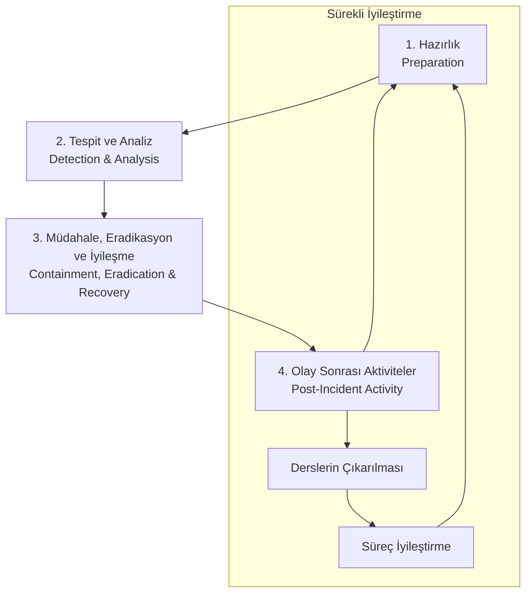

# 🚨 Seviye 1 - Olay Müdahalesi Temelleri

## 🎯 Seviye Hedefi

Bu bölümde, siber güvenlik olaylarına müdahale etmenin temel kavramlarını, süreçlerini ve metodolojilerini öğreneceksiniz. Amaç, güvenlik olaylarını tespit etme, analiz etme, müdahale etme ve iyileştirme konularında temel bir anlayış oluşturmaktır. Bu bilgiler, organizasyonlarda güvenlik olaylarına etkili bir şekilde yanıt verebilmek için gerekli temel becerileri sağlar.

## 📚 Konu Başlıkları

1.  [Executive Summary](#1-executive-summary)
2.  [Giriş: Olay Müdahalesi Nedir?](#2-giriş-olay-müdahalesi-nedir)
3.  [Olay Müdahale Yaşam Döngüsü](#3-olay-müdahale-yaşam-döngüsü)
4.  [Olay Sınıflandırması ve Önceliklendirme](#4-olay-sınıflandırması-ve-önceliklendirme)
5.  [Olay Müdahale Ekibi (CSIRT/CERT)](#5-olay-müdahale-ekibi-csirtcert)
6.  [Kanıt Toplama ve Adli Analiz Temelleri](#6-kanıt-toplama-ve-adli-analiz-temelleri)
7.  [İletişim ve Raporlama](#7-iletişim-ve-raporlama)
8.  [Yaygın Olay Türleri ve Müdahale Stratejileri](#8-yaygın-olay-türleri-ve-müdahale-stratejileri)
9.  [Araçlar ve Teknolojiler](#9-araçlar-ve-teknolojiler)
10. [Kaynaklar ve Referanslar](#10-kaynaklar-ve-referanslar)

---

## 1. Executive Summary

Olay müdahalesi (Incident Response), bir organizasyonda meydana gelen siber güvenlik olaylarını tespit etme, analiz etme, müdahale etme ve iyileştirme sürecinin sistematik bir yaklaşımıdır. Etkili bir olay müdahale programı, güvenlik ihlallerinin etkisini minimize eder, iyileşme süresini kısaltır ve gelecekteki saldırılara karşı organizasyonun direncini artırır. Bu bölüm, olay müdahalesinin temel kavramlarını, süreçlerini ve en iyi uygulamalarını tanıtarak sağlam bir temel oluşturmayı hedefler.

---

## 2. Giriş: Olay Müdahalesi Nedir?

Olay müdahalesi, bir organizasyonun bilgi güvenliği politikalarını ihlal eden veya ihlal etme potansiyeli olan olayları yönetmek için kullandığı yapılandırılmış yaklaşımdır. Bu olaylar, kötü amaçlı yazılım enfeksiyonlarından veri sızıntılarına, sistem kesintilerinden sosyal mühendislik saldırılarına kadar geniş bir yelpazede olabilir.

### Neden Önemlidir?

-   **Zarar Azaltma:** Güvenlik olaylarının etkisini minimize eder ve yayılmasını önler.
-   **Hızlı İyileşme:** Sistemlerin ve hizmetlerin normal işleyişe dönmesi için gereken süreyi kısaltır.
-   **Kanıt Koruma:** Yasal süreçler ve adli analiz için kritik kanıtları korur.
-   **Öğrenme ve İyileştirme:** Her olaydan ders çıkararak güvenlik duruşunu güçlendirir.
-   **Yasal ve Düzenleyici Uyumluluk:** GDPR, HIPAA, PCI DSS gibi düzenlemeler olay bildirimi gerektirir.
-   **İtibar Koruma:** Etkili müdahale, paydaşların güvenini korur.
-   **Maliyet Kontrolü:** Erken müdahale, uzun vadeli maliyetleri önemli ölçüde azaltır.

### Olay Müdahalesinin Kapsamı

-   **Proaktif Hazırlık:** Olay müdahale planları, prosedürler ve ekip eğitimi.
-   **Tespit ve Analiz:** Güvenlik olaylarını tanımlama ve değerlendirme.
-   **Müdahale ve Eradikasyon:** Tehdidi neutralize etme ve sistemlerden temizleme.
-   **İyileşme:** Sistemleri güvenli bir şekilde normale döndürme.
-   **Olay Sonrası Aktiviteler:** Derslerin çıkarılması ve süreçlerin iyileştirilmesi.

---

## 3. Olay Müdahale Yaşam Döngüsü

NIST (National Institute of Standards and Technology) SP 800-61 standardına göre olay müdahale yaşam döngüsü dört ana aşamadan oluşur:

### 1. Hazırlık (Preparation)

-   **Olay Müdahale Politikası ve Prosedürleri:** Organizasyonun olay müdahale yaklaşımını tanımlayan dokümantasyon.
-   **Olay Müdahale Ekibi Oluşturma:** CSIRT/CERT ekibinin kurulması ve eğitimi.
-   **Araç ve Teknoloji Hazırlığı:** Olay müdahalesi için gerekli araçların temin edilmesi ve yapılandırılması.
-   **İletişim Planları:** İç ve dış paydaşlarla iletişim prosedürleri.
-   **Eğitim ve Farkındalık:** Personelin olay müdahalesi konusunda eğitilmesi.
-   **Simülasyon ve Tatbikatlar:** Tabletop egzersizleri ve gerçek senaryolar.

### 2. Tespit ve Analiz (Detection and Analysis)

-   **Olay Tespiti:** Güvenlik olaylarının tanımlanması (SIEM, IDS/IPS, antivirüs uyarıları, kullanıcı raporları).
-   **İlk Değerlendirme:** Olayın doğruluğunun ve ciddiyetinin belirlenmesi.
-   **Olay Sınıflandırması:** Olay türü ve öncelik seviyesinin belirlenmesi.
-   **Kanıt Toplama:** Adli analiz için kritik verilerin korunması.
-   **Etki Analizi:** Olayın organizasyon üzerindeki potansiyel etkisinin değerlendirilmesi.
-   **Dokümantasyon:** Tüm bulguların ve eylemlerin kayıt altına alınması.

### 3. Müdahale, Eradikasyon ve İyileşme (Containment, Eradication, and Recovery)

**Müdahale (Containment):**
-   **Kısa Vadeli Müdahale:** Olayın yayılmasını hemen durdurma (ağ segmentasyonu, sistem izolasyonu).
-   **Uzun Vadeli Müdahale:** Kalıcı çözümler için geçici önlemler.
-   **Sistem Yedekleme:** Kritik sistemlerin yedeklenmesi.

**Eradikasyon (Eradication):**
-   **Kök Neden Analizi:** Olayın nasıl meydana geldiğinin belirlenmesi.
-   **Tehdit Temizleme:** Kötü amaçlı yazılımların, yetkisiz erişimlerin temizlenmesi.
-   **Zafiyet Giderme:** Saldırıda kullanılan zafiyetlerin kapatılması.

**İyileşme (Recovery):**
-   **Sistem Restore:** Temizlenmiş sistemlerin üretime geri döndürülmesi.
-   **İzleme:** Sistemlerin normal çalışıp çalışmadığının yakından takip edilmesi.
-   **Doğrulama:** Tehdidin tamamen temizlendiğinin onaylanması.

### 4. Olay Sonrası Aktiviteler (Post-Incident Activity)

-   **Olay Raporu Hazırlama:** Detaylı olay analizi ve müdahale sürecinin dokümantasyonu.
-   **Derslerin Çıkarılması (Lessons Learned):** Süreçlerdeki eksikliklerin belirlenmesi.
-   **Süreç İyileştirme:** Politika, prosedür ve araçların güncellenmesi.
-   **Eğitim Güncelleme:** Yeni tehditlere karşı personel eğitiminin güncellenmesi.
-   **Metrik ve KPI Analizi:** Olay müdahale performansının değerlendirilmesi.

---

## 4. Olay Sınıflandırması ve Önceliklendirme

Olayların etkili bir şekilde yönetilebilmesi için uygun şekilde sınıflandırılması ve önceliklendirilmesi gerekir.

### Olay Sınıflandırması

**Olay Türlerine Göre:**
-   **Kötü Amaçlı Yazılım (Malware):** Virüs, trojan, ransomware, spyware.
-   **Yetkisiz Erişim:** Hesap ele geçirme, privilege escalation, insider threats.
-   **Hizmet Reddi (DoS/DDoS):** Sistemlerin erişilemez hale getirilmesi.
-   **Veri Sızıntısı:** Hassas verilerin yetkisiz kişilerce elde edilmesi.
-   **Web Uygulaması Saldırıları:** SQL injection, XSS, CSRF.
-   **Ağ Saldırıları:** Man-in-the-middle, packet sniffing, ARP poisoning.
-   **Sosyal Mühendislik:** Phishing, pretexting, baiting.
-   **Fiziksel Güvenlik İhlalleri:** Yetkisiz fiziksel erişim.

### Önceliklendirme Kriterleri

**Etki Seviyesi:**
-   **Yüksek:** Kritik sistemlerin çalışmaması, büyük veri kaybı, yasal yükümlülükler.
-   **Orta:** Önemli sistemlerin etkilenmesi, sınırlı veri kaybı.
-   **Düşük:** Minimal etki, tek kullanıcı etkilenmesi.

**Aciliyet Seviyesi:**
-   **Kritik:** Hemen müdahale gerekli (0-1 saat).
-   **Yüksek:** Hızlı müdahale gerekli (1-4 saat).
-   **Orta:** Normal müdahale süresi (4-24 saat).
-   **Düşük:** Standart müdahale süresi (24-72 saat).

**Öncelik Matrisi:**

| Etki \ Aciliyet | Düşük | Orta | Yüksek | Kritik |
|------------------|-------|------|--------|--------|
| **Yüksek**       | P2    | P1   | P1     | P1     |
| **Orta**         | P3    | P2   | P2     | P1     |
| **Düşük**        | P4    | P3   | P3     | P2     |

---

## 5. Olay Müdahale Ekibi (CSIRT/CERT)

CSIRT (Computer Security Incident Response Team) veya CERT (Computer Emergency Response Team), organizasyonlarda güvenlik olaylarına müdahale etmekle görevli özel ekiplerdir.

### Ekip Yapısı ve Roller

**Olay Müdahale Yöneticisi (Incident Response Manager):**
-   Olay müdahale sürecinin genel koordinasyonu.
-   Karar verme yetkisi ve sorumluluk.
-   Üst yönetim ve dış paydaşlarla iletişim.

**Güvenlik Analisti (Security Analyst):**
-   Olay analizi ve araştırması.
-   Tehdit istihbaratı toplama.
-   Teknik detayların incelenmesi.

**Adli Analiz Uzmanı (Digital Forensics Specialist):**
-   Kanıt toplama ve koruma.
-   Adli analiz ve raporlama.
-   Yasal süreçlere destek.

**Sistem Yöneticisi (System Administrator):**
-   Sistem müdahalesi ve iyileştirme.
-   Teknik uygulama ve yapılandırma.
-   Sistem izleme ve doğrulama.

**Ağ Uzmanı (Network Specialist):**
-   Ağ trafiği analizi.
-   Ağ segmentasyonu ve izolasyon.
-   Ağ güvenlik kontrollerinin uygulanması.

**İletişim Uzmanı (Communications Specialist):**
-   İç ve dış iletişim koordinasyonu.
-   Medya ilişkileri yönetimi.
-   Kriz iletişimi.

**Hukuk Danışmanı (Legal Counsel):**
-   Yasal gerekliliklerin belirlenmesi.
-   Düzenleyici raporlama.
-   Yasal risk değerlendirmesi.

### Ekip Modelleri

**Merkezi Model:**
-   Tek bir CSIRT ekibi tüm organizasyona hizmet verir.
-   Küçük ve orta ölçekli organizasyonlar için uygun.
-   Kaynak verimliliği yüksek.

**Dağıtık Model:**
-   Her iş birimi veya coğrafi bölgede ayrı CSIRT ekipleri.
-   Büyük organizasyonlar için uygun.
-   Yerel uzmanlık ve hızlı müdahale.

**Koordine Model:**
-   Merkezi koordinasyon ile yerel ekiplerin birleşimi.
-   En yaygın kullanılan model.
-   Hem verimlilik hem de esneklik sağlar.

---

## 6. Kanıt Toplama ve Adli Analiz Temelleri

Adli analiz (Digital Forensics), dijital kanıtların yasal olarak kabul edilebilir şekilde toplanması, korunması, analiz edilmesi ve sunulması sürecidir.

### Kanıt Türleri

**Uçucu Kanıtlar (Volatile Evidence):**
-   RAM içeriği
-   Çalışan süreçler
-   Ağ bağlantıları
-   Geçici dosyalar
-   **Özellik:** Sistem kapatıldığında kaybolur, öncelikli toplanmalıdır.

**Kalıcı Kanıtlar (Non-Volatile Evidence):**
-   Hard disk içeriği
-   Log dosyaları
-   Yapılandırma dosyaları
-   Veritabanı kayıtları
-   **Özellik:** Sistem kapatılsa bile korunur.

### Kanıt Toplama Sırası (Order of Volatility)

1.  **CPU kayıtları ve cache**
2.  **RAM içeriği**
3.  **Ağ durumu ve bağlantıları**
4.  **Çalışan süreçler**
5.  **Disk içeriği**
6.  **Log dosyaları**
7.  **Fiziksel yapılandırma**
8.  **Arşiv medyası**

### Kanıt Zinciri (Chain of Custody)

Kanıt zinciri, dijital kanıtların toplanmasından mahkemeye sunulmasına kadar geçen süreçte kanıtların bütünlüğünün ve güvenilirliğinin korunmasını sağlayan dokümantasyon sürecidir.

**Gerekli Bilgiler:**
-   Kanıtı kim topladı?
-   Ne zaman toplandı?
-   Nerede saklandı?
-   Kim erişti?
-   Hangi analizler yapıldı?
-   Kanıtın hash değerleri (MD5, SHA-256)

### Temel Adli Analiz Araçları

-   **Disk İmajlama:** dd, FTK Imager, EnCase
-   **RAM Analizi:** Volatility, Rekall
-   **Ağ Analizi:** Wireshark, tcpdump
-   **Log Analizi:** Splunk, ELK Stack
-   **Hash Hesaplama:** md5sum, sha256sum

---

## 7. İletişim ve Raporlama

Etkili iletişim, olay müdahale sürecinin kritik bir bileşenidir. Doğru bilginin doğru zamanda doğru kişilere iletilmesi gerekir.

### İç İletişim

**Üst Yönetim:**
-   Olay özeti ve iş etkisi
-   Müdahale durumu
-   Kaynak ihtiyaçları
-   Risk değerlendirmesi

**Teknik Ekipler:**
-   Detaylı teknik bilgiler
-   Müdahale adımları
-   Sistem durumu güncellemeleri

**Son Kullanıcılar:**
-   Hizmet etkileri
-   Geçici çözümler
-   Güvenlik önerileri

### Dış İletişim

**Düzenleyici Otoriteler:**
-   Yasal raporlama gereklilikleri
-   Belirlenen sürelerde bildirim
-   Standart formatlar

**Müşteriler ve Ortaklar:**
-   Hizmet etkileri
-   Alınan önlemler
-   İyileştirme planları

**Medya:**
-   Kontrollü bilgi paylaşımı
-   İtibar yönetimi
-   Şeffaflık ve güven

### Olay Raporlama

**İlk Rapor (Initial Report):**
-   Olay özeti
-   İlk bulgular
-   Alınan acil önlemler
-   Sonraki adımlar

**Durum Güncellemeleri (Status Updates):**
-   Müdahale ilerlemesi
-   Yeni bulgular
-   Değişen risk değerlendirmesi

**Final Rapor (Final Report):**
-   Detaylı olay analizi
-   Kök neden analizi
-   Alınan tüm önlemler
-   Derslerin çıkarılması
-   İyileştirme önerileri

---

## 8. Yaygın Olay Türleri ve Müdahale Stratejileri

### Kötü Amaçlı Yazılım (Malware) Olayları

**Tespit İşaretleri:**
-   Antivirüs uyarıları
-   Anormal sistem performansı
-   Beklenmeyen ağ trafiği
-   Dosya değişiklikleri

**Müdahale Stratejisi:**
1.  Etkilenen sistemleri ağdan izole etme
2.  Malware örneklerini analiz için koruma
3.  Temizleme araçları ile eradikasyon
4.  Sistem yeniden imajlama (gerekirse)
5.  Güvenlik yamalarının uygulanması

### Veri Sızıntısı Olayları

**Tespit İşaretleri:**
-   DLP (Data Loss Prevention) uyarıları
-   Anormal veri erişimi
-   Büyük veri transferleri
-   Yetkisiz sistem erişimi

**Müdahale Stratejisi:**
1.  Sızıntının kapsamını belirleme
2.  Veri akışını durdurma
3.  Etkilenen veri türlerini tanımlama
4.  Yasal gereklilikleri değerlendirme
5.  Etkilenen tarafları bilgilendirme

### Hesap Ele Geçirme Olayları

**Tespit İşaretleri:**
-   Anormal giriş aktiviteleri
-   Coğrafi anomaliler
-   Yetki değişiklikleri
-   Kullanıcı şikayetleri

**Müdahale Stratejisi:**
1.  Etkilenen hesapları devre dışı bırakma
2.  Parolaları sıfırlama
3.  Oturum tokenlarını geçersiz kılma
4.  Hesap aktivitelerini inceleme
5.  MFA zorunluluğu getirme

### DDoS Saldırıları

**Tespit İşaretleri:**
-   Hizmet kesintileri
-   Anormal trafik artışı
-   Sunucu kaynak tükenmesi
-   Kullanıcı erişim sorunları

**Müdahale Stratejisi:**
1.  Trafik analizi yapma
2.  DDoS koruma servislerini aktifleştirme
3.  Trafik filtreleme kuralları uygulama
4.  ISP ile koordinasyon
5.  Alternatif hizmet yolları açma

---

## 9. Araçlar ve Teknolojiler

### SIEM (Security Information and Event Management)

**Açık Kaynak:**
-   **ELK Stack (Elasticsearch, Logstash, Kibana)**
-   **OSSIM (Open Source Security Information Management)**
-   **Wazuh**

**Ticari:**
-   **Splunk**
-   **IBM QRadar**
-   **ArcSight**

### Olay Müdahale Platformları

-   **TheHive:** Açık kaynak olay müdahale platformu
-   **Phantom (Splunk SOAR):** Güvenlik orkestrasyon ve otomasyon
-   **Demisto (Palo Alto XSOAR):** Güvenlik orkestrasyon platformu
-   **IBM Resilient:** Olay müdahale ve orkestrasyon

### Adli Analiz Araçları

**Disk Analizi:**
-   **Autopsy:** Açık kaynak dijital adli analiz platformu
-   **EnCase:** Ticari adli analiz çözümü
-   **FTK (Forensic Toolkit):** Kapsamlı adli analiz paketi

**Ağ Analizi:**
-   **Wireshark:** Ağ protokol analizi
-   **NetworkMiner:** Ağ adli analiz aracı
-   **tcpdump:** Komut satırı paket yakalama

**Bellek Analizi:**
-   **Volatility:** Bellek dump analizi
-   **Rekall:** Gelişmiş bellek analizi

### Tehdit İstihbaratı

-   **MISP (Malware Information Sharing Platform)**
-   **OpenCTI:** Açık kaynak tehdit istihbaratı platformu
-   **ThreatConnect:** Ticari tehdit istihbaratı platformu

---

## 10. Kaynaklar ve Referanslar

### 📋 Standartlar ve Çerçeveler

-   **NIST SP 800-61 Rev. 2:** Computer Security Incident Handling Guide
-   **ISO/IEC 27035:** Information Security Incident Management
-   **SANS Incident Response Process:** 6 aşamalı olay müdahale süreci
-   **ENISA Good Practice Guide:** Incident Response

### 📖 Önerilen Kitaplar

-   "Incident Response & Computer Forensics" - Jason T. Luttgens, Matthew Pepe, Kevin Mandia
-   "The Practice of Network Security Monitoring" - Richard Bejtlich
-   "Applied Incident Response" - Steve Anson
-   "Digital Forensics and Incident Response" - Gerard Johansen

### 🌐 Online Kaynaklar

-   **SANS Reading Room:** <mcurl name="SANS Reading Room" url="https://www.sans.org/reading-room/"></mcurl>
-   **NIST Cybersecurity Framework:** <mcurl name="NIST CSF" url="https://www.nist.gov/cyberframework"></mcurl>
-   **FIRST (Forum of Incident Response and Security Teams):** <mcurl name="FIRST" url="https://www.first.org/"></mcurl>
-   **ENISA (European Union Agency for Cybersecurity):** <mcurl name="ENISA" url="https://www.enisa.europa.eu/"></mcurl>

### 🛠️ Pratik Laboratuvarlar

-   **SANS FOR508:** Advanced Incident Response, Threat Hunting, and Digital Forensics
-   **Cybrary Incident Response Path:** Ücretsiz online eğitim
-   **TryHackMe Incident Response Room:** Pratik senaryolar

### 🏆 Sertifikasyonlar

-   **GCIH (GIAC Certified Incident Handler)**
-   **GCFA (GIAC Certified Forensic Analyst)**
-   **GNFA (GIAC Network Forensic Analyst)**
-   **CISSP (Certified Information Systems Security Professional)**

---

## ✅ Seviye 1 - Olay Müdahalesi Temelleri Tamamlama Kriterleri

### 📋 Teorik Bilgi

-   [ ] Olay müdahalesinin neden önemli olduğunu ve organizasyonlara sağladığı faydaları açıklayabilme.
-   [ ] NIST olay müdahale yaşam döngüsünün 4 aşamasını sıralayabilme ve her aşamada yapılan temel aktiviteleri sayabilme.
-   [ ] Olay sınıflandırması ve önceliklendirme kriterlerini (etki, aciliyet) açıklayabilme.
-   [ ] CSIRT/CERT ekibinin temel rollerini ve sorumluluklarını sayabilme.
-   [ ] Kanıt zinciri (Chain of Custody) kavramını ve önemini açıklayabilme.
-   [ ] Uçucu ve kalıcı kanıt türleri arasındaki farkı bilme.
-   [ ] Olay müdahalesinde iletişimin önemini ve farklı paydaşlarla iletişim stratejilerini anlama.
-   [ ] Yaygın olay türlerini (malware, veri sızıntısı, hesap ele geçirme, DDoS) tanımlayabilme.

### 🛠️ Pratik Beceriler (Teorik Anlayış)

-   [ ] Basit bir güvenlik olayı senaryosunda hangi adımların izlenmesi gerektiğini sıralayabilme.
-   [ ] Bir olay için öncelik seviyesini (kritik, yüksek, orta, düşük) belirleyebilme.
-   [ ] Olay müdahale sürecinde hangi kanıtların toplanması gerektiğini belirleyebilme.
-   [ ] Basit bir olay raporu formatını anlayabilme.

### 🔧 Araç Farkındalığı

-   [ ] SIEM sistemlerinin olay müdahalesindeki rolünü anlama.
-   [ ] Temel adli analiz araçlarını (Wireshark, Volatility, Autopsy) tanıma.
-   [ ] Log analizi araçlarının önemini kavrama.

### 🔗 Bağlantılı Konular

Bu bölümdeki bilgiler, aşağıdaki konularla yakından ilişkilidir:

-   <mcfile name="network-security.md" path="/Users/ibrahim/CyberSecuirty101-RoadMap/level-1/network-security.md"></mcfile> (Ağ güvenliği izleme)
-   <mcfile name="system-security.md" path="/Users/ibrahim/CyberSecuirty101-RoadMap/level-1/system-security.md"></mcfile> (Sistem log analizi)
-   <mcfile name="owasp-top10.md" path="/Users/ibrahim/CyberSecuirty101-RoadMap/level-1/owasp-top10.md"></mcfile> (Web uygulama saldırıları)

---

## 🎯 Pratik Laboratuvar: Basit Olay Müdahale Simülasyonu

### Senaryo: Şüpheli Ağ Aktivitesi

Bir çalışan, bilgisayarının yavaş çalıştığını ve beklenmeyen pop-up'lar gördüğünü bildirdi. Aynı zamanda ağ izleme sistemleri anormal dış bağlantılar tespit etti.

### Görevler:

1.  **İlk Değerlendirme:**
    -   Olayın ciddiyetini değerlendirin (düşük/orta/yüksek/kritik)
    -   Hangi CSIRT rollerinin devreye girmesi gerektiğini belirleyin

2.  **Müdahale Planı:**
    -   İlk 30 dakikada yapılması gereken adımları listeleyin
    -   Hangi kanıtların toplanması gerektiğini belirleyin
    -   Müdahale stratejisini (izolasyon, analiz, temizleme) planlayın

3.  **İletişim:**
    -   Üst yönetime verilecek ilk raporu hazırlayın
    -   Etkilenen kullanıcıya verilecek talimatları yazın

### Beklenen Çıktılar:

-   Olay öncelik değerlendirmesi
-   Adım adım müdahale planı
-   İletişim şablonları
-   Kanıt toplama listesi

---

**Sonraki Konu**: Seviye 1 tamamlandı. [Seviye 2 - Penetrasyon Testi Temelleri](../level-2/penetration-testing-basics.md) (Bu dosya henüz oluşturulmadı)

*Bu doküman siber güvenlik yol haritasının bir parçasıdır. Katkıda bulunmak veya en son sürümü görmek için ana repoyu ziyaret edin.*