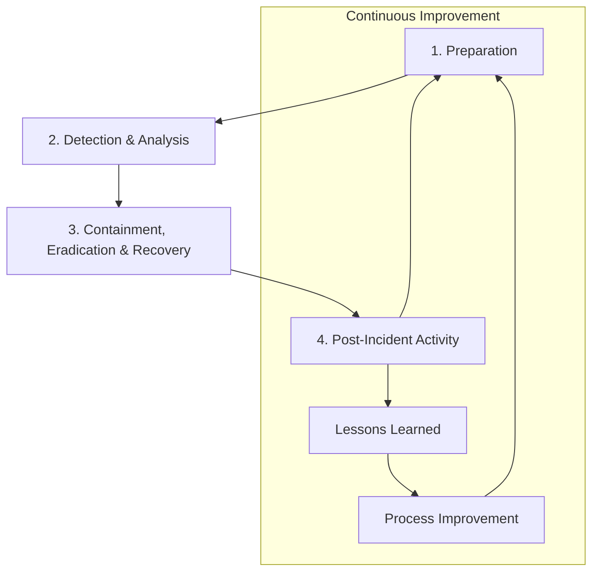

# 🚨 Level 1 - Incident Response Basics

## 🎯 Level Objective

In this section, you will learn the fundamental concepts, processes, and methodologies of responding to cybersecurity incidents. The goal is to build a basic understanding of detecting, analyzing, responding to, and recovering from security incidents. This knowledge provides the essential skills needed to effectively respond to security incidents in organizations.

## 📚 Topics

1. [Executive Summary](#1-executive-summary)
2. [Introduction: What is Incident Response?](#2-introduction-what-is-incident-response)
3. [Incident Response Lifecycle](#3-incident-response-lifecycle)
4. [Incident Classification and Prioritization](#4-incident-classification-and-prioritization)
5. [Incident Response Team (CSIRT/CERT)](#5-incident-response-team-csirtcert)
6. [Evidence Collection and Digital Forensics Fundamentals](#6-evidence-collection-and-digital-forensics-fundamentals)
7. [Communication and Reporting](#7-communication-and-reporting)
8. [Common Incident Types and Response Strategies](#8-common-incident-types-and-response-strategies)
9. [Tools and Technologies](#9-tools-and-technologies)
10. [Resources and References](#10-resources-and-references)

---

## 1. Executive Summary

Incident Response is a systematic approach to detecting, analyzing, responding to, and recovering from cybersecurity incidents that occur in an organization. An effective incident response program minimizes the impact of security breaches, shortens recovery time, and increases the organization's resilience against future attacks. This section aims to establish a solid foundation by introducing the fundamental concepts, processes, and best practices of incident response.

---

## 2. Introduction: What is Incident Response?

Incident response is a structured approach used by an organization to manage events that violate or have the potential to violate information security policies. These events can range from malware infections to data breaches, from system outages to social engineering attacks.

### Why is it Important?

- **Damage Mitigation:** Minimizes the impact of security incidents and prevents their spread.
- **Rapid Recovery:** Shortens the time required for systems and services to return to normal operation.
- **Evidence Preservation:** Protects critical evidence for legal processes and forensic analysis.
- **Learning and Improvement:** Strengthens security posture by learning from each incident.
- **Legal and Regulatory Compliance:** Regulations like GDPR, HIPAA, PCI DSS require incident reporting.
- **Reputation Protection:** Effective response preserves stakeholder confidence.
- **Cost Control:** Early intervention significantly reduces long-term costs.

### Scope of Incident Response

- **Proactive Preparation:** Incident response plans, procedures, and team training.
- **Detection and Analysis:** Identifying and evaluating security incidents.
- **Response and Eradication:** Neutralizing threats and cleaning them from systems.
- **Recovery:** Safely returning systems to normal operation.
- **Post-Incident Activities:** Learning lessons and improving processes.

---

## 3. Incident Response Lifecycle

According to NIST (National Institute of Standards and Technology) SP 800-61 standard, the incident response lifecycle consists of four main phases:

### 1. Preparation

- **Incident Response Policy and Procedures:** Documentation defining the organization's incident response approach.
- **Incident Response Team Formation:** Establishing and training CSIRT/CERT team.
- **Tool and Technology Preparation:** Procuring and configuring necessary tools for incident response.
- **Communication Plans:** Procedures for communication with internal and external stakeholders.
- **Training and Awareness:** Training personnel on incident response.
- **Simulations and Exercises:** Tabletop exercises and real scenarios.

### 2. Detection and Analysis

- **Incident Detection:** Identifying security incidents (SIEM, IDS/IPS, antivirus alerts, user reports).
- **Initial Assessment:** Determining the validity and severity of the incident.
- **Incident Classification:** Determining incident type and priority level.
- **Evidence Collection:** Preserving critical data for forensic analysis.
- **Impact Analysis:** Evaluating the potential impact of the incident on the organization.
- **Documentation:** Recording all findings and actions.

### 3. Containment, Eradication, and Recovery

**Containment:**
- **Short-term Containment:** Immediately stopping the spread of the incident (network segmentation, system isolation).
- **Long-term Containment:** Temporary measures for permanent solutions.
- **System Backup:** Backing up critical systems.

**Eradication:**
- **Root Cause Analysis:** Determining how the incident occurred.
- **Threat Removal:** Cleaning malware, unauthorized access.
- **Vulnerability Remediation:** Closing vulnerabilities used in the attack.

**Recovery:**
- **System Restoration:** Safely returning systems to production.
- **Monitoring:** Closely monitoring whether systems are operating normally.
- **Validation:** Confirming that the threat has been completely eliminated.

### 4. Post-Incident Activity

- **Incident Report Preparation:** Detailed incident analysis and documentation of response process.
- **Lessons Learned:** Identifying deficiencies in processes.
- **Process Improvement:** Updating policies, procedures, and tools.
- **Training Updates:** Updating personnel training against new threats.
- **Metrics and KPI Analysis:** Evaluating incident response performance.

---

## 4. Incident Classification and Prioritization

For incidents to be managed effectively, they need to be properly classified and prioritized.

### Incident Classification

**By Incident Type:**
- **Malware:** Virus, trojan, ransomware, spyware.
- **Unauthorized Access:** Account compromise, privilege escalation, insider threats.
- **Denial of Service (DoS/DDoS):** Making systems inaccessible.
- **Data Breach:** Unauthorized acquisition of sensitive data.
- **Web Application Attacks:** SQL injection, XSS, CSRF.
- **Network Attacks:** Man-in-the-middle, packet sniffing, ARP poisoning.
- **Social Engineering:** Phishing, pretexting, baiting.
- **Physical Security Breaches:** Unauthorized physical access.

### Prioritization Criteria

**Impact Level:**
- **High:** Critical system failure, major data loss, legal obligations.
- **Medium:** Important systems affected, limited data loss.
- **Low:** Minimal impact, single user affected.

**Urgency Level:**
- **Critical:** Immediate response required (0-1 hour).
- **High:** Rapid response required (1-4 hours).
- **Medium:** Normal response time (4-24 hours).
- **Low:** Standard response time (24-72 hours).

**Priority Matrix:**

| Impact \ Urgency | Low | Medium | High | Critical |
|------------------|-----|--------|------|----------|
| **High**         | P2  | P1     | P1   | P1       |
| **Medium**       | P3  | P2     | P2   | P1       |
| **Low**          | P4  | P3     | P3   | P2       |

---

## 5. Incident Response Team (CSIRT/CERT)

CSIRT (Computer Security Incident Response Team) or CERT (Computer Emergency Response Team) are specialized teams responsible for responding to security incidents in organizations.

### Team Structure and Roles

**Incident Response Manager:**
- Overall coordination of incident response process.
- Decision-making authority and responsibility.
- Communication with senior management and external stakeholders.

**Security Analyst:**
- Incident analysis and investigation.
- Threat intelligence gathering.
- Technical detail examination.

**Digital Forensics Specialist:**
- Evidence collection and preservation.
- Forensic analysis and reporting.
- Support for legal processes.

**System Administrator:**
- System intervention and recovery.
- Technical implementation and configuration.
- System monitoring and validation.

**Network Specialist:**
- Network traffic analysis.
- Network segmentation and isolation.
- Implementation of network security controls.

**Communications Specialist:**
- Internal and external communication coordination.
- Media relations management.
- Crisis communication.

**Legal Counsel:**
- Determining legal requirements.
- Regulatory reporting.
- Legal risk assessment.

### Team Models

**Centralized Model:**
- Single CSIRT team serves the entire organization.
- Suitable for small and medium-sized organizations.
- High resource efficiency.

**Distributed Model:**
- Separate CSIRT teams in each business unit or geographic region.
- Suitable for large organizations.
- Local expertise and rapid response.

**Coordinated Model:**
- Combination of central coordination with local teams.
- Most widely used model.
- Provides both efficiency and flexibility.

---

## 6. Evidence Collection and Digital Forensics Fundamentals

Digital Forensics is the process of collecting, preserving, analyzing, and presenting digital evidence in a legally acceptable manner.

### Types of Evidence

**Volatile Evidence:**
- RAM contents
- Running processes
- Network connections
- Temporary files
- **Characteristic:** Lost when system is shut down, should be collected with priority.

**Non-Volatile Evidence:**
- Hard disk contents
- Log files
- Configuration files
- Database records
- **Characteristic:** Preserved even if system is shut down.

### Order of Volatility

1. **CPU registers and cache**
2. **RAM contents**
3. **Network state and connections**
4. **Running processes**
5. **Disk contents**
6. **Log files**
7. **Physical configuration**
8. **Archive media**

### Chain of Custody

Chain of custody is the documentation process that ensures the integrity and reliability of digital evidence from collection to presentation in court.

**Required Information:**
- Who collected the evidence?
- Where was it stored?
- Who accessed it?
- What analyses were performed?
- Hash values of evidence (MD5, SHA-256)

### Basic Digital Forensics Tools

- **Disk Imaging:** dd, FTK Imager, EnCase
- **RAM Analysis:** Volatility, Rekall
- **Network Analysis:** Wireshark, tcpdump
- **Log Analysis:** Splunk, ELK Stack
- **Hash Calculation:** md5sum, sha256sum

---

## 7. Communication and Reporting

Effective communication is a critical component of the incident response process. The right information must be communicated to the right people at the right time.

### Internal Communication

**Senior Management:**
- Incident summary and business impact
- Response status
- Resource requirements
- Risk assessment

**Technical Teams:**
- Detailed technical information
- Response steps
- System status updates

**End Users:**
- Service impacts
- Temporary solutions
- Security recommendations

### External Communication

**Regulatory Authorities:**
- Legal reporting requirements
- Notification within specified timeframes
- Standard formats

**Customers and Partners:**
- Service impacts
- Measures taken
- Recovery plans

**Media:**
- Controlled information sharing
- Reputation management
- Transparency and trust

### Incident Reporting

**Initial Report:**
- Incident summary
- Initial findings
- Emergency measures taken
- Next steps

**Status Updates:**
- Response progress
- New findings
- Changing risk assessment

**Final Report:**
- Detailed incident analysis
- Root cause analysis
- All measures taken
- Lessons learned
- Improvement recommendations

---

## 8. Common Incident Types and Response Strategies

### Malware Incidents

**Detection Indicators:**
- Antivirus alerts
- Abnormal system performance
- Unexpected network traffic
- File modifications

**Response Strategy:**
1. Isolate affected systems from network
2. Preserve malware samples for analysis
3. Eradication with cleaning tools
4. System re-imaging (if necessary)
5. Apply security patches

### Data Breach Incidents

**Detection Indicators:**
- DLP (Data Loss Prevention) alerts
- Abnormal data access
- Large data transfers
- Unauthorized system access

**Response Strategy:**
1. Determine scope of breach
2. Stop data flow
3. Identify affected data types
4. Assess legal requirements
5. Notify affected parties

### Account Compromise Incidents

**Detection Indicators:**
- Abnormal login activities
- Geographic anomalies
- Permission changes
- User complaints

**Response Strategy:**
1. Disable affected accounts
2. Reset passwords
3. Invalidate session tokens
4. Review account activities
5. Implement MFA requirement

### DDoS Attacks

**Detection Indicators:**
- Service outages
- Abnormal traffic increase
- Server resource exhaustion
- User access problems

**Response Strategy:**
1. Perform traffic analysis
2. Activate DDoS protection services
3. Apply traffic filtering rules
4. Coordinate with ISP
5. Open alternative service paths

---

## 9. Tools and Technologies

### SIEM (Security Information and Event Management)

**Open Source:**
- **ELK Stack (Elasticsearch, Logstash, Kibana)**
- **OSSIM (Open Source Security Information Management)**
- **Wazuh**

**Commercial:**
- **Splunk**
- **IBM QRadar**
- **ArcSight**

### Incident Response Platforms

- **TheHive:** Open source incident response platform
- **Phantom (Splunk SOAR):** Security orchestration and automation
- **Demisto (Palo Alto XSOAR):** Security orchestration platform
- **IBM Resilient:** Incident response and orchestration

### Digital Forensics Tools

**Disk Analysis:**
- **Autopsy:** Open source digital forensics platform
- **EnCase:** Commercial forensics solution
- **FTK (Forensic Toolkit):** Comprehensive forensics package

**Network Analysis:**
- **Wireshark:** Network protocol analysis
- **NetworkMiner:** Network forensics tool
- **tcpdump:** Command-line packet capture

**Memory Analysis:**
- **Volatility:** Memory dump analysis
- **Rekall:** Advanced memory analysis

### Threat Intelligence

- **MISP (Malware Information Sharing Platform)**
- **OpenCTI:** Open source threat intelligence platform
- **ThreatConnect:** Commercial threat intelligence platform

---

## 10. Resources and References

### 📋 Standards and Frameworks

- **NIST SP 800-61 Rev. 2:** Computer Security Incident Handling Guide
- **ISO/IEC 27035:** Information Security Incident Management
- **SANS Incident Response Process:** 6-phase incident response process
- **ENISA Good Practice Guide:** Incident Response

### 📖 Recommended Books

- "Incident Response & Computer Forensics" - Jason T. Luttgens, Matthew Pepe, Kevin Mandia
- "The Practice of Network Security Monitoring" - Richard Bejtlich
- "Applied Incident Response" - Steve Anson
- "Digital Forensics and Incident Response" - Gerard Johansen

### 🌐 Online Resources

- **SANS Reading Room:** [SANS Reading Room](https://www.sans.org/reading-room/)
- **NIST Cybersecurity Framework:** [NIST CSF](https://www.nist.gov/cyberframework)
- **FIRST (Forum of Incident Response and Security Teams):** [FIRST](https://www.first.org/)
- **ENISA (European Union Agency for Cybersecurity):** [ENISA](https://www.enisa.europa.eu/)

### 🛠️ Practical Laboratories

- **SANS FOR508:** Advanced Incident Response, Threat Hunting, and Digital Forensics
- **Cybrary Incident Response Path:** Free online training
- **TryHackMe Incident Response Room:** Practical scenarios

### 🏆 Certifications

- **GCIH (GIAC Certified Incident Handler)**
- **GCFA (GIAC Certified Forensic Analyst)**
- **GNFA (GIAC Network Forensic Analyst)**
- **CISSP (Certified Information Systems Security Professional)**

---

## ✅ Level 1 - Incident Response Fundamentals Completion Criteria

### 📋 Theoretical Knowledge

- [ ] Ability to explain why incident response is important and the benefits it provides to organizations.
- [ ] Ability to list the 4 phases of NIST incident response lifecycle and enumerate basic activities performed in each phase.
- [ ] Ability to explain incident classification and prioritization criteria (impact, urgency).
- [ ] Ability to list basic roles and responsibilities of CSIRT/CERT team.
- [ ] Ability to explain the concept and importance of Chain of Custody.
- [ ] Knowledge of differences between volatile and non-volatile evidence types.
- [ ] Understanding the importance of communication in incident response and communication strategies with different stakeholders.
- [ ] Ability to identify common incident types (malware, data breach, account compromise, DDoS).

### 🛠️ Practical Skills (Theoretical Understanding)

- [ ] Ability to list steps to follow in a simple security incident scenario.
- [ ] Ability to determine priority level (critical, high, medium, low) for an incident.
- [ ] Ability to determine what evidence should be collected during incident response.
- [ ] Ability to understand basic incident report format.

### 🔧 Tool Awareness

- [ ] Understanding the role of SIEM systems in incident response.
- [ ] Recognition of basic forensic analysis tools (Wireshark, Volatility, Autopsy).
- [ ] Understanding the importance of log analysis tools.

### 🔗 Related Topics

The information in this section is closely related to the following topics:

- [Network Security](./network-security.md) (Network security monitoring)
- [System Security](./system-security.md) (System log analysis)
- [OWASP Top 10](./owasp-top10.md) (Web application attacks)

---

## 🎯 Practical Laboratory: Simple Incident Response Simulation

### Scenario: Suspicious Network Activity

An employee reported that their computer is running slowly and they are seeing unexpected pop-ups. At the same time, network monitoring systems detected abnormal external connections.

### Tasks:

1. **Initial Assessment:**
   - Assess the severity of the incident (low/medium/high/critical)
   - Determine which CSIRT roles should be involved

2. **Response Plan:**
   - List steps to be taken in the first 30 minutes
   - Determine what evidence needs to be collected
   - Plan response strategy (isolation, analysis, cleanup)

3. **Communication:**
   - Prepare initial report for senior management
   - Write instructions for affected user

### Expected Outputs:

- Incident priority assessment
- Step-by-step response plan
- Communication templates
- Evidence collection checklist

---

**Next Topic**: Level 1 completed. [Level 2 - Penetration Testing Fundamentals](../level-2/penetration-testing-basics.md) (This file has not been created yet)

*This document is part of the cybersecurity roadmap. Visit the main repository to contribute or see the latest version.*