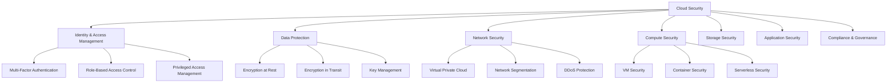

# Cloud Security Fundamentals

## 1. Executive Summary

### Konunun Özeti ve Önemi
Bulut güvenliği, modern IT altyapısının temel taşlarından biridir. Organizasyonların %95'i bulut hizmetlerini kullanırken, güvenlik endişeleri hala en büyük engel olarak görülmektedir. Bu modül, AWS, Azure ve Google Cloud Platform'larda güvenli bulut mimarisi tasarlama, uygulama ve yönetme konularını kapsamaktadır.

### Öğrenme Hedefleri
- Bulut güvenlik modellerini anlama (Shared Responsibility Model)
- Multi-cloud güvenlik stratejileri geliştirme
- Identity and Access Management (IAM) best practices
- Bulut native güvenlik araçlarını kullanma
- Compliance ve governance framework'lerini uygulama
- Container ve serverless güvenliği
- DevSecOps pipeline'larında güvenlik entegrasyonu

### Gerçek Dünya Uygulaması
- Enterprise bulut migrasyonu güvenlik planlaması
- Multi-cloud security posture management
- Zero-trust architecture implementation
- Cloud incident response ve forensics
- Automated security compliance monitoring

## 2. Theoretical Foundation

### Kavramsal Açıklama

#### Shared Responsibility Model
```yaml
# Cloud Security Responsibility Matrix
cloud_security_model:
  cloud_provider_responsibilities:
    infrastructure:
      - physical_security
      - network_controls
      - host_operating_system
      - hypervisor
    platform_services:
      - managed_database_patching
      - managed_service_configuration
      - service_availability
    
  customer_responsibilities:
    data_protection:
      - data_encryption
      - data_classification
      - backup_strategies
    identity_management:
      - user_access_controls
      - authentication_mechanisms
      - privilege_management
    application_security:
      - secure_coding_practices
      - vulnerability_management
      - security_testing
    network_security:
      - firewall_configuration
      - network_segmentation
      - traffic_monitoring
```

#### Cloud Security Domains


### Tarihsel Context

#### Cloud Security Evolution
```timeline
2006: AWS Launch
├── Basic security groups
├── Simple storage encryption
└── Limited compliance options

2010: Multi-Cloud Era
├── Azure and GCP emergence
├── Hybrid cloud architectures
└── First cloud security frameworks

2015: Container Revolution
├── Docker security concerns
├── Kubernetes security models
└── Microservices security patterns

2020: Zero Trust Adoption
├── Never trust, always verify
├── Identity-centric security
└── Continuous verification

2024: AI-Powered Security
├── ML-based threat detection
├── Automated incident response
└── Predictive security analytics
```

### Current State of the Art

#### Modern Cloud Security Trends
- **Cloud Security Posture Management (CSPM)**
- **Cloud Workload Protection Platforms (CWPP)**
- **Cloud Access Security Brokers (CASB)**
- **Secure Access Service Edge (SASE)**
- **Extended Detection and Response (XDR)**

## 3. Technical Deep Dive

### AWS Security Architecture

#### AWS Security Services Overview
```python
#!/usr/bin/env python3
# AWS Security Services Integration

import boto3
import json
from datetime import datetime, timedelta

class AWSSecurityManager:
    def __init__(self, region='us-east-1'):
        self.region = region
        self.session = boto3.Session()
        
        # Initialize AWS service clients
        self.iam = self.session.client('iam')
        self.guardduty = self.session.client('guardduty')
        self.securityhub = self.session.client('securityhub')
        self.config = self.session.client('config')
        self.cloudtrail = self.session.client('cloudtrail')
        self.inspector = self.session.client('inspector2')
        self.macie = self.session.client('macie2')
    
    def setup_security_baseline(self):
        """Setup AWS security baseline configuration"""
        print("[+] Setting up AWS security baseline...")
        
        # Enable GuardDuty
        self.enable_guardduty()
        
        # Enable Security Hub
        self.enable_security_hub()
        
        # Enable Config
        self.enable_config()
        
        # Enable CloudTrail
        self.enable_cloudtrail()
        
        # Enable Inspector
        self.enable_inspector()
        
        # Enable Macie
        self.enable_macie()
    
    def enable_guardduty(self):
        """Enable and configure GuardDuty"""
        try:
            # Create GuardDuty detector
            response = self.guardduty.create_detector(
                Enable=True,
                FindingPublishingFrequency='FIFTEEN_MINUTES',
                DataSources={
                    'S3Logs': {'Enable': True},
                    'KubernetesAuditLogs': {'Enable': True},
                    'MalwareProtection': {'ScanEc2InstanceWithFindings': {'EbsVolumes': True}}
                }
            )
            detector_id = response['DetectorId']
            print(f"[+] GuardDuty enabled with detector ID: {detector_id}")
            
            # Create threat intel set
            self.create_threat_intel_set(detector_id)
            
            return detector_id
        except Exception as e:
            print(f"[-] Error enabling GuardDuty: {str(e)}")
            return None
    
    def create_threat_intel_set(self, detector_id):
        """Create threat intelligence set for GuardDuty"""
        try:
            # Sample threat intel (in production, use real threat feeds)
            threat_ips = [
                '192.0.2.1',  # Example malicious IP
                '203.0.113.1',  # Example C&C server
                '198.51.100.1'  # Example botnet IP
            ]
            
            # Create S3 object with threat intel
            s3 = self.session.client('s3')
            bucket_name = f'guardduty-threat-intel-{self.region}'
            
            # Create threat intel file content
            threat_intel_content = '\n'.join(threat_ips)
            
            # Upload to S3 (bucket should exist)
            try:
                s3.put_object(
                    Bucket=bucket_name,
                    Key='threat-intel.txt',
                    Body=threat_intel_content
                )
                
                # Create threat intel set in GuardDuty
                response = self.guardduty.create_threat_intel_set(
                    DetectorId=detector_id,
                    Name='CustomThreatIntel',
                    Format='TXT',
                    Location=f's3://{bucket_name}/threat-intel.txt',
                    Activate=True
                )
                print(f"[+] Threat intel set created: {response['ThreatIntelSetId']}")
            except Exception as e:
                print(f"[!] Could not create threat intel set: {str(e)}")
                
        except Exception as e:
            print(f"[-] Error creating threat intel set: {str(e)}")
    
    def enable_security_hub(self):
        """Enable and configure Security Hub"""
        try:
            # Enable Security Hub
            response = self.securityhub.enable_security_hub(
                EnableDefaultStandards=True
            )
            print("[+] Security Hub enabled")
            
            # Enable additional standards
            standards = [
                'arn:aws:securityhub:::ruleset/finding-format/aws-foundational-security-standard/v/1.0.0',
                'arn:aws:securityhub:::ruleset/finding-format/cis-aws-foundations-benchmark/v/1.2.0',
                'arn:aws:securityhub:::ruleset/finding-format/pci-dss/v/3.2.1'
            ]
            
            for standard in standards:
                try:
                    self.securityhub.batch_enable_standards(
                        StandardsSubscriptionRequests=[
                            {'StandardsArn': standard}
                        ]
                    )
                    print(f"[+] Enabled standard: {standard.split('/')[-2]}")
                except Exception as e:
                    print(f"[!] Could not enable standard {standard}: {str(e)}")
                    
        except Exception as e:
            print(f"[-] Error enabling Security Hub: {str(e)}")
    
    def enable_config(self):
        """Enable and configure AWS Config"""
        try:
            # Create configuration recorder
            self.config.put_configuration_recorder(
                ConfigurationRecorder={
                    'name': 'default',
                    'roleARN': f'arn:aws:iam::{self.get_account_id()}:role/aws-config-role',
                    'recordingGroup': {
                        'allSupported': True,
                        'includeGlobalResourceTypes': True
                    }
                }
            )
            
            # Create delivery channel
            self.config.put_delivery_channel(
                DeliveryChannel={
                    'name': 'default',
                    's3BucketName': f'aws-config-bucket-{self.get_account_id()}',
                    'configSnapshotDeliveryProperties': {
                        'deliveryFrequency': 'TwentyFour_Hours'
                    }
                }
            )
            
            # Start configuration recorder
            self.config.start_configuration_recorder(
                ConfigurationRecorderName='default'
            )
            
            print("[+] AWS Config enabled")
            
        except Exception as e:
            print(f"[-] Error enabling Config: {str(e)}")
    
    def enable_cloudtrail(self):
        """Enable and configure CloudTrail"""
        try:
            trail_name = 'security-audit-trail'
            s3_bucket = f'cloudtrail-logs-{self.get_account_id()}'
            
            response = self.cloudtrail.create_trail(
                Name=trail_name,
                S3BucketName=s3_bucket,
                IncludeGlobalServiceEvents=True,
                IsMultiRegionTrail=True,
                EnableLogFileValidation=True,
                EventSelectors=[
                    {
                        'ReadWriteType': 'All',
                        'IncludeManagementEvents': True,
                        'DataResources': [
                            {
                                'Type': 'AWS::S3::Object',
                                'Values': ['arn:aws:s3:::*/*']
                            }
                        ]
                    }
                ]
            )
            
            # Start logging
            self.cloudtrail.start_logging(Name=trail_name)
            
            print(f"[+] CloudTrail enabled: {trail_name}")
            
        except Exception as e:
            print(f"[-] Error enabling CloudTrail: {str(e)}")
    
    def enable_inspector(self):
        """Enable and configure Inspector v2"""
        try:
            response = self.inspector.enable(
                accountIds=[self.get_account_id()],
                resourceTypes=['ECR', 'EC2']
            )
            print("[+] Inspector v2 enabled")
            
        except Exception as e:
            print(f"[-] Error enabling Inspector: {str(e)}")
    
    def enable_macie(self):
        """Enable and configure Macie"""
        try:
            response = self.macie.enable_macie(
                findingPublishingFrequency='FIFTEEN_MINUTES'
            )
            print("[+] Macie enabled")
            
        except Exception as e:
            print(f"[-] Error enabling Macie: {str(e)}")
    
    def get_account_id(self):
        """Get AWS account ID"""
        sts = self.session.client('sts')
        return sts.get_caller_identity()['Account']
    
    def get_security_findings(self, days=7):
        """Get security findings from multiple sources"""
        findings = {
            'guardduty': [],
            'security_hub': [],
            'inspector': [],
            'macie': []
        }
        
        # Get GuardDuty findings
        try:
            detectors = self.guardduty.list_detectors()['DetectorIds']
            for detector_id in detectors:
                response = self.guardduty.list_findings(
                    DetectorId=detector_id,
                    FindingCriteria={
                        'Criterion': {
                            'updatedAt': {
                                'gte': int((datetime.now() - timedelta(days=days)).timestamp() * 1000)
                            }
                        }
                    }
                )
                findings['guardduty'].extend(response['FindingIds'])
        except Exception as e:
            print(f"[!] Error getting GuardDuty findings: {str(e)}")
        
        # Get Security Hub findings
        try:
            response = self.securityhub.get_findings(
                Filters={
                    'UpdatedAt': [
                        {
                            'Start': (datetime.now() - timedelta(days=days)).isoformat(),
                            'End': datetime.now().isoformat()
                        }
                    ]
                }
            )
            findings['security_hub'] = response['Findings']
        except Exception as e:
            print(f"[!] Error getting Security Hub findings: {str(e)}")
        
        return findings
    
    def generate_security_report(self):
        """Generate comprehensive security report"""
        print("\n" + "="*50)
        print("AWS SECURITY POSTURE REPORT")
        print("="*50)
        
        findings = self.get_security_findings()
        
        print(f"\nGuardDuty Findings: {len(findings['guardduty'])}")
        print(f"Security Hub Findings: {len(findings['security_hub'])}")
        print(f"Inspector Findings: {len(findings['inspector'])}")
        print(f"Macie Findings: {len(findings['macie'])}")
        
        # Analyze findings by severity
        severity_counts = {'HIGH': 0, 'MEDIUM': 0, 'LOW': 0, 'INFORMATIONAL': 0}
        
        for finding in findings['security_hub']:
            severity = finding.get('Severity', {}).get('Label', 'INFORMATIONAL')
            severity_counts[severity] = severity_counts.get(severity, 0) + 1
        
        print("\nFindings by Severity:")
        for severity, count in severity_counts.items():
            print(f"  {severity}: {count}")
        
        return findings

# Usage example
if __name__ == "__main__":
    # Initialize AWS Security Manager
    aws_security = AWSSecurityManager()
    
    # Setup security baseline
    aws_security.setup_security_baseline()
    
    # Generate security report
    aws_security.generate_security_report()
```

#### AWS IAM Best Practices
```python
#!/usr/bin/env python3
# AWS IAM Security Automation

import boto3
import json
from datetime import datetime, timedelta

class IAMSecurityAuditor:
    def __init__(self):
        self.iam = boto3.client('iam')
        self.sts = boto3.client('sts')
    
    def audit_iam_policies(self):
        """Audit IAM policies for security issues"""
        print("[+] Starting IAM policy audit...")
        
        issues = []
        
        # Get all policies
        paginator = self.iam.get_paginator('list_policies')
        
        for page in paginator.paginate(Scope='Local'):
            for policy in page['Policies']:
                policy_issues = self.analyze_policy(policy)
                if policy_issues:
                    issues.extend(policy_issues)
        
        return issues
    
    def analyze_policy(self, policy):
        """Analyze individual policy for security issues"""
        issues = []
        
        # Get policy document
        try:
            response = self.iam.get_policy_version(
                PolicyArn=policy['Arn'],
                VersionId=policy['DefaultVersionId']
            )
            
            policy_doc = response['PolicyVersion']['Document']
            
            # Check for overly permissive policies
            if self.has_wildcard_permissions(policy_doc):
                issues.append({
                    'type': 'WILDCARD_PERMISSIONS',
                    'policy': policy['PolicyName'],
                    'arn': policy['Arn'],
                    'severity': 'HIGH',
                    'description': 'Policy contains wildcard (*) permissions'
                })
            
            # Check for admin access
            if self.has_admin_access(policy_doc):
                issues.append({
                    'type': 'ADMIN_ACCESS',
                    'policy': policy['PolicyName'],
                    'arn': policy['Arn'],
                    'severity': 'CRITICAL',
                    'description': 'Policy grants administrative access'
                })
            
            # Check for unused policies
            if self.is_policy_unused(policy):
                issues.append({
                    'type': 'UNUSED_POLICY',
                    'policy': policy['PolicyName'],
                    'arn': policy['Arn'],
                    'severity': 'MEDIUM',
                    'description': 'Policy is not attached to any entity'
                })
                
        except Exception as e:
            print(f"[!] Error analyzing policy {policy['PolicyName']}: {str(e)}")
        
        return issues
    
    def has_wildcard_permissions(self, policy_doc):
        """Check if policy has wildcard permissions"""
        statements = policy_doc.get('Statement', [])
        if not isinstance(statements, list):
            statements = [statements]
        
        for statement in statements:
            if statement.get('Effect') == 'Allow':
                actions = statement.get('Action', [])
                if not isinstance(actions, list):
                    actions = [actions]
                
                for action in actions:
                    if '*' in action:
                        return True
        
        return False
    
    def has_admin_access(self, policy_doc):
        """Check if policy grants admin access"""
        statements = policy_doc.get('Statement', [])
        if not isinstance(statements, list):
            statements = [statements]
        
        for statement in statements:
            if (statement.get('Effect') == 'Allow' and 
                statement.get('Action') == '*' and 
                statement.get('Resource') == '*'):
                return True
        
        return False
    
    def assess_azure_security(self):
        """Assess Azure security posture"""
        if not self.azure_clients:
            return None
        
        print("[+] Assessing Azure security posture...")
        
        assessment = {
            'provider': 'Azure',
            'timestamp': datetime.now().isoformat(),
            'findings': [],
            'score': 0
        }
        
        try:
            # Get security alerts
            alerts = list(self.azure_clients['security'].alerts.list())
            
            for alert in alerts:
                assessment['findings'].append({
                    'type': 'AZURE_SECURITY_ALERT',
                    'severity': alert.severity,
                    'resource': alert.display_name,
                    'description': alert.description
                })
        
        except Exception as e:
            print(f"[!] Error assessing Azure security: {str(e)}")
        
        assessment['score'] = self.calculate_security_score(assessment['findings'])
        return assessment
    
    def assess_gcp_security(self):
        """Assess GCP security posture"""
        if not self.gcp_clients:
            return None
        
        print("[+] Assessing GCP security posture...")
        
        assessment = {
            'provider': 'GCP',
            'timestamp': datetime.now().isoformat(),
            'findings': [],
            'score': 0
        }
        
        try:
            # Get security findings
            org_name = f"organizations/123456789"  # Replace with actual org ID
            findings = self.gcp_clients['security'].list_findings(
                request={"parent": f"{org_name}/sources/-"}
            )
            
            for finding in findings:
                assessment['findings'].append({
                    'type': 'GCP_SECURITY_FINDING',
                    'severity': finding.finding.severity,
                    'resource': finding.finding.resource_name,
                    'description': finding.finding.description
                })
        
        except Exception as e:
            print(f"[!] Error assessing GCP security: {str(e)}")
        
        assessment['score'] = self.calculate_security_score(assessment['findings'])
        return assessment
    
    def calculate_security_score(self, findings):
        """Calculate security score based on findings"""
        if not findings:
            return 100
        
        severity_weights = {
            'CRITICAL': 25,
            'HIGH': 15,
            'MEDIUM': 10,
            'LOW': 5
        }
        
        total_deduction = 0
        for finding in findings:
            severity = finding.get('severity', 'LOW')
            total_deduction += severity_weights.get(severity, 5)
        
        score = max(0, 100 - total_deduction)
        return score
    
    def run_assessment(self):
        """Run comprehensive multi-cloud security assessment"""
        print("\n" + "="*60)
        print("MULTI-CLOUD SECURITY ASSESSMENT")
        print("="*60)
        
        assessments = []
        
        # Run assessments in parallel
        with concurrent.futures.ThreadPoolExecutor(max_workers=3) as executor:
            futures = []
            
            # AWS assessment
            futures.append(executor.submit(self.assess_aws_security))
            
            # Azure assessment
            if self.azure_clients:
                futures.append(executor.submit(self.assess_azure_security))
            
            # GCP assessment
            if self.gcp_clients:
                futures.append(executor.submit(self.assess_gcp_security))
            
            # Collect results
            for future in concurrent.futures.as_completed(futures):
                result = future.result()
                if result:
                    assessments.append(result)
        
        # Generate summary report
        self.generate_summary_report(assessments)
        
        return assessments
    
    def generate_summary_report(self, assessments):
        """Generate summary report for all cloud providers"""
        print("\nSUMMARY REPORT")
        print("-" * 40)
        
        total_findings = 0
        avg_score = 0
        
        for assessment in assessments:
            provider = assessment['provider']
            findings_count = len(assessment['findings'])
            score = assessment['score']
            
            print(f"\n{provider}:")
            print(f"  Security Score: {score}/100")
            print(f"  Findings: {findings_count}")
            
            # Show top findings
            critical_findings = [f for f in assessment['findings'] if f.get('severity') == 'CRITICAL']
            if critical_findings:
                print(f"  Critical Issues: {len(critical_findings)}")
                for finding in critical_findings[:3]:  # Show top 3
                    print(f"    - {finding['description']}")
            
            total_findings += findings_count
            avg_score += score
        
        if assessments:
            avg_score = avg_score / len(assessments)
            print(f"\nOVERALL SUMMARY:")
            print(f"  Average Security Score: {avg_score:.1f}/100")
            print(f"  Total Findings: {total_findings}")
            
            # Security recommendations
            if avg_score < 70:
                print(f"\n⚠️  SECURITY RECOMMENDATIONS:")
                print(f"  - Immediate attention required for critical findings")
                print(f"  - Implement security baseline configurations")
                print(f"  - Enable comprehensive monitoring and alerting")
                print(f"  - Conduct regular security assessments")

# Usage example
if __name__ == "__main__":
    # Initialize multi-cloud assessment
    assessment = MultiCloudSecurityAssessment(
        aws_region='us-east-1',
        azure_subscription_id='your-azure-subscription-id',  # Optional
        gcp_project_id='your-gcp-project-id'  # Optional
    )
    
    # Run comprehensive assessment
    results = assessment.run_assessment()
```

### Practical Exercise 2: Container Security

#### Docker Security Scanning
```bash
#!/bin/bash
# Container Security Assessment Script

echo "[+] Container Security Assessment"

# Install security scanning tools
echo "[+] Installing security tools..."

# Install Trivy (vulnerability scanner)
curl -sfL https://raw.githubusercontent.com/aquasecurity/trivy/main/contrib/install.sh | sh -s -- -b /usr/local/bin

# Install Docker Bench Security
git clone https://github.com/docker/docker-bench-security.git
cd docker-bench-security

# Run Docker Bench Security
echo "[+] Running Docker Bench Security..."
sudo sh docker-bench-security.sh

# Scan container images
echo "[+] Scanning container images..."

# Example vulnerable container
docker pull vulnerables/web-dvwa

# Scan with Trivy
trivy image vulnerables/web-dvwa

# Scan with Clair (if available)
if command -v clair-scanner &> /dev/null; then
    clair-scanner --ip="$(ip route get 1 | awk '{print $NF;exit}')" vulnerables/web-dvwa
fi

echo "[+] Container security assessment complete"
```

#### Kubernetes Security Configuration
```yaml
# k8s-security-policies.yaml
# Kubernetes Security Policies and Configurations

# Pod Security Policy
apiVersion: policy/v1beta1
kind: PodSecurityPolicy
metadata:
  name: restricted-psp
spec:
  privileged: false
  allowPrivilegeEscalation: false
  requiredDropCapabilities:
    - ALL
  volumes:
    - 'configMap'
    - 'emptyDir'
    - 'projected'
    - 'secret'
    - 'downwardAPI'
    - 'persistentVolumeClaim'
  runAsUser:
    rule: 'MustRunAsNonRoot'
  seLinux:
    rule: 'RunAsAny'
  fsGroup:
    rule: 'RunAsAny'

---
# Network Policy
apiVersion: networking.k8s.io/v1
kind: NetworkPolicy
metadata:
  name: deny-all-ingress
  namespace: production
spec:
  podSelector: {}
  policyTypes:
  - Ingress
  - Egress
  egress:
  - to:
    - namespaceSelector:
        matchLabels:
          name: kube-system
    ports:
    - protocol: TCP
      port: 53
    - protocol: UDP
      port: 53

---
# Security Context
apiVersion: v1
kind: Pod
metadata:
  name: secure-pod
spec:
  securityContext:
    runAsNonRoot: true
    runAsUser: 1000
    fsGroup: 2000
  containers:
  - name: app
    image: nginx:alpine
    securityContext:
      allowPrivilegeEscalation: false
      readOnlyRootFilesystem: true
      capabilities:
        drop:
        - ALL
    volumeMounts:
    - name: tmp
      mountPath: /tmp
    - name: var-cache
      mountPath: /var/cache/nginx
    - name: var-run
      mountPath: /var/run
  volumes:
  - name: tmp
    emptyDir: {}
  - name: var-cache
    emptyDir: {}
  - name: var-run
    emptyDir: {}
```

## 5. Code Examples

### Cloud Security Automation Framework

```python
#!/usr/bin/env python3
# Cloud Security Automation Framework

import asyncio
import aiohttp
import json
from dataclasses import dataclass
from typing import List, Dict, Any
from datetime import datetime
import logging

# Configure logging
logging.basicConfig(level=logging.INFO)
logger = logging.getLogger(__name__)

@dataclass
class SecurityFinding:
    """Security finding data structure"""
    id: str
    title: str
    severity: str
    description: str
    resource: str
    provider: str
    timestamp: datetime
    remediation: str = ""

class CloudSecurityOrchestrator:
    """Orchestrate security operations across multiple cloud providers"""
    
    def __init__(self):
        self.findings: List[SecurityFinding] = []
        self.remediation_actions = {
            'AWS': self.aws_remediation,
            'Azure': self.azure_remediation,
            'GCP': self.gcp_remediation
        }
    
    async def scan_all_providers(self) -> List[SecurityFinding]:
        """Scan all cloud providers for security issues"""
        logger.info("Starting multi-cloud security scan")
        
        tasks = [
            self.scan_aws(),
            self.scan_azure(),
            self.scan_gcp()
        ]
        
        results = await asyncio.gather(*tasks, return_exceptions=True)
        
        all_findings = []
        for result in results:
            if isinstance(result, list):
                all_findings.extend(result)
            elif isinstance(result, Exception):
                logger.error(f"Scan failed: {result}")
        
        self.findings = all_findings
        return all_findings
    
    async def scan_aws(self) -> List[SecurityFinding]:
        """Scan AWS for security issues"""
        logger.info("Scanning AWS environment")
        
        findings = []
        
        # Simulate AWS security findings
        aws_findings = [
            {
                'id': 'aws-001',
                'title': 'S3 Bucket Public Read Access',
                'severity': 'HIGH',
                'description': 'S3 bucket allows public read access',
                'resource': 'arn:aws:s3:::my-bucket',
                'remediation': 'Remove public read permissions from S3 bucket'
            },
            {
                'id': 'aws-002',
                'title': 'Security Group Open to World',
                'severity': 'CRITICAL',
                'description': 'Security group allows inbound traffic from 0.0.0.0/0',
                'resource': 'sg-12345678',
                'remediation': 'Restrict security group rules to specific IP ranges'
            }
        ]
        
        for finding_data in aws_findings:
            finding = SecurityFinding(
                id=finding_data['id'],
                title=finding_data['title'],
                severity=finding_data['severity'],
                description=finding_data['description'],
                resource=finding_data['resource'],
                provider='AWS',
                timestamp=datetime.now(),
                remediation=finding_data['remediation']
            )
            findings.append(finding)
        
        return findings
    
    async def scan_azure(self) -> List[SecurityFinding]:
        """Scan Azure for security issues"""
        logger.info("Scanning Azure environment")
        
        findings = []
        
        # Simulate Azure security findings
        azure_findings = [
            {
                'id': 'azure-001',
                'title': 'Storage Account Public Access',
                'severity': 'HIGH',
                'description': 'Storage account allows public blob access',
                'resource': '/subscriptions/sub-id/resourceGroups/rg/providers/Microsoft.Storage/storageAccounts/storage',
                'remediation': 'Disable public blob access on storage account'
            }
        ]
        
        for finding_data in azure_findings:
            finding = SecurityFinding(
                id=finding_data['id'],
                title=finding_data['title'],
                severity=finding_data['severity'],
                description=finding_data['description'],
                resource=finding_data['resource'],
                provider='Azure',
                timestamp=datetime.now(),
                remediation=finding_data['remediation']
            )
            findings.append(finding)
        
        return findings
    
    async def scan_gcp(self) -> List[SecurityFinding]:
        """Scan GCP for security issues"""
        logger.info("Scanning GCP environment")
        
        findings = []
        
        # Simulate GCP security findings
        gcp_findings = [
            {
                'id': 'gcp-001',
                'title': 'Compute Instance Public IP',
                'severity': 'MEDIUM',
                'description': 'Compute instance has public IP address',
                'resource': 'projects/project-id/zones/us-central1-a/instances/instance-1',
                'remediation': 'Remove public IP and use Cloud NAT for outbound connectivity'
            }
        ]
        
        for finding_data in gcp_findings:
            finding = SecurityFinding(
                id=finding_data['id'],
                title=finding_data['title'],
                severity=finding_data['severity'],
                description=finding_data['description'],
                resource=finding_data['resource'],
                provider='GCP',
                timestamp=datetime.now(),
                remediation=finding_data['remediation']
            )
            findings.append(finding)
        
        return findings
    
    async def auto_remediate(self, finding: SecurityFinding) -> bool:
        """Automatically remediate security finding"""
        logger.info(f"Attempting auto-remediation for {finding.id}")
        
        remediation_func = self.remediation_actions.get(finding.provider)
        if remediation_func:
            try:
                success = await remediation_func(finding)
                if success:
                    logger.info(f"Successfully remediated {finding.id}")
                else:
                    logger.warning(f"Failed to remediate {finding.id}")
                return success
            except Exception as e:
                logger.error(f"Error during remediation of {finding.id}: {e}")
                return False
        else:
            logger.warning(f"No remediation available for provider {finding.provider}")
            return False
    
    async def aws_remediation(self, finding: SecurityFinding) -> bool:
        """AWS-specific remediation actions"""
        if 'S3' in finding.title:
            # Simulate S3 bucket policy update
            logger.info(f"Updating S3 bucket policy for {finding.resource}")
            await asyncio.sleep(1)  # Simulate API call
            return True
        elif 'Security Group' in finding.title:
            # Simulate security group rule update
            logger.info(f"Updating security group rules for {finding.resource}")
            await asyncio.sleep(1)  # Simulate API call
            return True
        return False
    
    async def azure_remediation(self, finding: SecurityFinding) -> bool:
        """Azure-specific remediation actions"""
        if 'Storage Account' in finding.title:
            # Simulate storage account configuration update
            logger.info(f"Updating storage account configuration for {finding.resource}")
            await asyncio.sleep(1)  # Simulate API call
            return True
        return False
    
    async def gcp_remediation(self, finding: SecurityFinding) -> bool:
        """GCP-specific remediation actions"""
        if 'Compute Instance' in finding.title:
            # Simulate compute instance configuration update
            logger.info(f"Updating compute instance configuration for {finding.resource}")
            await asyncio.sleep(1)  # Simulate API call
            return True
        return False
    
    def generate_report(self) -> Dict[str, Any]:
        """Generate security report"""
        if not self.findings:
            return {'message': 'No findings to report'}
        
        # Categorize findings by severity
        severity_counts = {'CRITICAL': 0, 'HIGH': 0, 'MEDIUM': 0, 'LOW': 0}
        provider_counts = {}
        
        for finding in self.findings:
            severity_counts[finding.severity] = severity_counts.get(finding.severity, 0) + 1
            provider_counts[finding.provider] = provider_counts.get(finding.provider, 0) + 1
        
        report = {
            'timestamp': datetime.now().isoformat(),
            'total_findings': len(self.findings),
            'severity_breakdown': severity_counts,
            'provider_breakdown': provider_counts,
            'findings': [
                {
                    'id': f.id,
                    'title': f.title,
                    'severity': f.severity,
                    'provider': f.provider,
                    'resource': f.resource,
                    'description': f.description,
                    'remediation': f.remediation
                }
                for f in self.findings
            ]
        }
        
        return report
    
    async def send_alert(self, finding: SecurityFinding) -> bool:
        """Send alert for critical findings"""
        if finding.severity in ['CRITICAL', 'HIGH']:
            logger.info(f"Sending alert for {finding.severity} finding: {finding.title}")
            
            # Simulate webhook/email notification
            alert_data = {
                'finding_id': finding.id,
                'title': finding.title,
                'severity': finding.severity,
                'provider': finding.provider,
                'resource': finding.resource,
                'timestamp': finding.timestamp.isoformat()
            }
            
            # In a real implementation, this would send to Slack, email, etc.
            logger.info(f"Alert sent: {json.dumps(alert_data, indent=2)}")
            return True
        
        return False

# Main execution function
async def main():
    """Main security orchestration workflow"""
    orchestrator = CloudSecurityOrchestrator()
    
    # Scan all cloud providers
    findings = await orchestrator.scan_all_providers()
    
    logger.info(f"Found {len(findings)} security issues")
    
    # Send alerts for critical findings
    for finding in findings:
        await orchestrator.send_alert(finding)
    
    # Attempt auto-remediation for high-severity findings
    for finding in findings:
        if finding.severity in ['CRITICAL', 'HIGH']:
            await orchestrator.auto_remediate(finding)
    
    # Generate and display report
    report = orchestrator.generate_report()
    print("\n" + "="*50)
    print("CLOUD SECURITY REPORT")
    print("="*50)
    print(json.dumps(report, indent=2))

if __name__ == "__main__":
    asyncio.run(main())
```

## 6. Recommended Tools and Platforms

### Commercial Cloud Security Platforms

#### AWS Security Tools
- **AWS Security Hub**: Centralized security findings management
- **AWS GuardDuty**: Threat detection service
- **AWS Config**: Configuration compliance monitoring
- **AWS CloudTrail**: API activity logging
- **AWS Inspector**: Application security assessment
- **AWS Macie**: Data security and privacy service

#### Azure Security Tools
- **Azure Security Center**: Unified security management
- **Azure Sentinel**: Cloud-native SIEM
- **Azure Key Vault**: Secrets management
- **Azure Policy**: Governance and compliance
- **Azure Monitor**: Comprehensive monitoring solution

#### Google Cloud Security Tools
- **Security Command Center**: Security and risk management
- **Cloud Security Scanner**: Web application vulnerability scanner
- **Cloud KMS**: Key management service
- **Cloud IAM**: Identity and access management
- **Cloud Logging**: Centralized logging

### Open Source Security Tools

#### Multi-Cloud Security
- **Prowler**: AWS/Azure/GCP security assessment
- **ScoutSuite**: Multi-cloud security auditing
- **CloudSploit**: Cloud security scanning
- **Pacbot**: Policy as Code Bot

#### Container Security
- **Trivy**: Vulnerability scanner
- **Clair**: Static analysis for containers
- **Falco**: Runtime security monitoring
- **OPA Gatekeeper**: Policy enforcement

## 7. Configuration Best Practices

### Infrastructure as Code Security

```hcl
# terraform-security-baseline.tf
# Terraform Security Baseline Configuration

# Provider configuration with security settings
terraform {
  required_version = ">= 1.0"
  required_providers {
    aws = {
      source  = "hashicorp/aws"
      version = "~> 5.0"
    }
  }
  
  # Remote state with encryption
  backend "s3" {
    bucket         = "terraform-state-bucket"
    key            = "infrastructure/terraform.tfstate"
    region         = "us-east-1"
    encrypt        = true
    dynamodb_table = "terraform-locks"
  }
}

# Data sources for security
data "aws_caller_identity" "current" {}
data "aws_region" "current" {}

# Security baseline resources
resource "aws_cloudtrail" "security_trail" {
  name           = "security-audit-trail"
  s3_bucket_name = aws_s3_bucket.cloudtrail_bucket.bucket
  
  enable_logging                = true
  include_global_service_events = true
  is_multi_region_trail        = true
  enable_log_file_validation   = true
  
  event_selector {
    read_write_type                 = "All"
    include_management_events       = true
    exclude_management_event_sources = []
    
    data_resource {
      type   = "AWS::S3::Object"
      values = ["arn:aws:s3:::*/*"]
    }
  }
  
  tags = {
    Environment = "production"
    Purpose     = "security-audit"
  }
}

# S3 bucket for CloudTrail with security settings
resource "aws_s3_bucket" "cloudtrail_bucket" {
  bucket        = "security-cloudtrail-${random_id.bucket_suffix.hex}"
  force_destroy = false
  
  tags = {
    Environment = "production"
    Purpose     = "cloudtrail-logs"
  }
}

resource "aws_s3_bucket_encryption" "cloudtrail_encryption" {
  bucket = aws_s3_bucket.cloudtrail_bucket.id
  
  server_side_encryption_configuration {
    rule {
      apply_server_side_encryption_by_default {
        sse_algorithm     = "aws:kms"
        kms_master_key_id = aws_kms_key.cloudtrail_key.arn
      }
    }
  }
}

resource "aws_s3_bucket_public_access_block" "cloudtrail_pab" {
  bucket = aws_s3_bucket.cloudtrail_bucket.id
  
  block_public_acls       = true
  block_public_policy     = true
  ignore_public_acls      = true
  restrict_public_buckets = true
}

# KMS key for encryption
resource "aws_kms_key" "cloudtrail_key" {
  description             = "KMS key for CloudTrail encryption"
  deletion_window_in_days = 7
  
  policy = jsonencode({
    Version = "2012-10-17"
    Statement = [
      {
        Sid    = "Enable IAM User Permissions"
        Effect = "Allow"
        Principal = {
          AWS = "arn:aws:iam::${data.aws_caller_identity.current.account_id}:root"
        }
        Action   = "kms:*"
        Resource = "*"
      },
      {
        Sid    = "Allow CloudTrail to encrypt logs"
        Effect = "Allow"
        Principal = {
          Service = "cloudtrail.amazonaws.com"
        }
        Action = [
          "kms:GenerateDataKey*",
          "kms:DescribeKey"
        ]
        Resource = "*"
      }
    ]
  })
  
  tags = {
    Environment = "production"
    Purpose     = "cloudtrail-encryption"
  }
}

resource "aws_kms_alias" "cloudtrail_key_alias" {
  name          = "alias/cloudtrail-encryption"
  target_key_id = aws_kms_key.cloudtrail_key.key_id
}

# Random ID for unique naming
resource "random_id" "bucket_suffix" {
  byte_length = 4
}

# Security Group with restrictive rules
resource "aws_security_group" "secure_sg" {
  name_prefix = "secure-sg-"
  description = "Security group with restrictive rules"
  vpc_id      = aws_vpc.secure_vpc.id
  
  # No ingress rules by default (deny all inbound)
  
  egress {
    description = "HTTPS outbound"
    from_port   = 443
    to_port     = 443
    protocol    = "tcp"
    cidr_blocks = ["0.0.0.0/0"]
  }
  
  egress {
    description = "HTTP outbound (for package updates)"
    from_port   = 80
    to_port     = 80
    protocol    = "tcp"
    cidr_blocks = ["0.0.0.0/0"]
  }
  
  tags = {
    Environment = "production"
    Purpose     = "secure-baseline"
  }
}

# VPC with security-focused configuration
resource "aws_vpc" "secure_vpc" {
  cidr_block           = "10.0.0.0/16"
  enable_dns_hostnames = true
  enable_dns_support   = true
  
  tags = {
    Name        = "secure-vpc"
    Environment = "production"
  }
}

# VPC Flow Logs for network monitoring
resource "aws_flow_log" "vpc_flow_log" {
  iam_role_arn    = aws_iam_role.flow_log_role.arn
  log_destination = aws_cloudwatch_log_group.vpc_flow_log.arn
  traffic_type    = "ALL"
  vpc_id          = aws_vpc.secure_vpc.id
  
  tags = {
    Environment = "production"
    Purpose     = "network-monitoring"
  }
}

resource "aws_cloudwatch_log_group" "vpc_flow_log" {
  name              = "/aws/vpc/flowlogs"
  retention_in_days = 30
  
  tags = {
    Environment = "production"
    Purpose     = "vpc-flow-logs"
  }
}

resource "aws_iam_role" "flow_log_role" {
  name = "flow-log-role"
  
  assume_role_policy = jsonencode({
    Version = "2012-10-17"
    Statement = [
      {
        Action = "sts:AssumeRole"
        Effect = "Allow"
        Principal = {
          Service = "vpc-flow-logs.amazonaws.com"
        }
      }
    ]
  })
}

resource "aws_iam_role_policy" "flow_log_policy" {
  name = "flow-log-policy"
  role = aws_iam_role.flow_log_role.id
  
  policy = jsonencode({
    Version = "2012-10-17"
    Statement = [
      {
        Action = [
          "logs:CreateLogGroup",
          "logs:CreateLogStream",
          "logs:PutLogEvents",
          "logs:DescribeLogGroups",
          "logs:DescribeLogStreams"
        ]
        Effect   = "Allow"
        Resource = "*"
      }
    ]
  })
}
```

### CI/CD Security Integration

```yaml
# .github/workflows/security-scan.yml
# GitHub Actions Security Scanning Workflow

name: Security Scan

on:
  push:
    branches: [ main, develop ]
  pull_request:
    branches: [ main ]
  schedule:
    - cron: '0 2 * * *'  # Daily at 2 AM

jobs:
  security-scan:
    runs-on: ubuntu-latest
    
    steps:
    - name: Checkout code
      uses: actions/checkout@v3
      
    - name: Setup Python
      uses: actions/setup-python@v4
      with:
        python-version: '3.9'
        
    - name: Install security tools
      run: |
        pip install bandit safety checkov
        
    - name: Run Bandit (Python security linter)
      run: |
        bandit -r . -f json -o bandit-report.json
        
    - name: Run Safety (dependency vulnerability check)
      run: |
        safety check --json --output safety-report.json
        
    - name: Run Checkov (Infrastructure as Code security)
      run: |
        checkov -d . --framework terraform --output json --output-file checkov-report.json
        
    - name: Setup Terraform
      uses: hashicorp/setup-terraform@v2
      with:
        terraform_version: 1.5.0
        
    - name: Terraform Security Scan
      run: |
        terraform init
        terraform plan -out=tfplan
        terraform show -json tfplan > tfplan.json
        
    - name: Run TFSec
      uses: aquasecurity/tfsec-action@v1.0.0
      with:
        soft_fail: true
        
    - name: Upload security reports
      uses: actions/upload-artifact@v3
      with:
        name: security-reports
        path: |
          bandit-report.json
          safety-report.json
          checkov-report.json
          
    - name: Security notification
      if: failure()
      uses: 8398a7/action-slack@v3
      with:
        status: failure
        text: 'Security scan failed! Please check the reports.'
      env:
        SLACK_WEBHOOK_URL: ${{ secrets.SLACK_WEBHOOK }}
```

## 8. Real-World Case Studies

### Case Study 1: Multi-Cloud Data Breach Prevention

**Scenario**: A financial services company operating across AWS, Azure, and GCP needs to implement comprehensive data protection.

**Challenge**: 
- Sensitive customer data stored across multiple cloud providers
- Compliance requirements (PCI DSS, SOX)
- Need for unified security monitoring

**Solution Implementation**:

```python
#!/usr/bin/env python3
# Multi-Cloud Data Protection Framework

import boto3
import json
from azure.identity import DefaultAzureCredential
from azure.mgmt.security import SecurityCenter
from google.cloud import securitycenter
from datetime import datetime, timedelta

class DataProtectionFramework:
    """Comprehensive data protection across cloud providers"""
    
    def __init__(self):
        self.aws_session = boto3.Session()
        self.azure_credential = DefaultAzureCredential()
        self.gcp_client = securitycenter.SecurityCenterClient()
        
    def classify_data(self, data_location: str, provider: str) -> dict:
        """Classify data based on sensitivity levels"""
        classification_rules = {
            'PII': ['ssn', 'credit_card', 'email', 'phone'],
            'Financial': ['account_number', 'routing_number', 'balance'],
            'Health': ['medical_record', 'diagnosis', 'prescription'],
            'Public': ['marketing_data', 'public_announcements']
        }
        
        # Simulate data classification
        detected_types = []
        
        if provider == 'AWS':
            # Use AWS Macie for data classification
            macie = self.aws_session.client('macie2')
            # Implementation would call Macie APIs
            detected_types = ['PII', 'Financial']
            
        elif provider == 'Azure':
            # Use Azure Information Protection
            # Implementation would call Azure APIs
            detected_types = ['PII']
            
        elif provider == 'GCP':
            # Use Cloud DLP API
            # Implementation would call GCP DLP APIs
            detected_types = ['Financial']
        
        return {
            'location': data_location,
            'provider': provider,
            'classification': detected_types,
            'risk_level': self._calculate_risk_level(detected_types),
            'timestamp': datetime.now().isoformat()
        }
    
    def _calculate_risk_level(self, data_types: list) -> str:
        """Calculate risk level based on data types"""
        if any(dt in ['PII', 'Financial', 'Health'] for dt in data_types):
            return 'HIGH'
        elif 'Internal' in data_types:
            return 'MEDIUM'
        else:
            return 'LOW'
    
    def apply_encryption(self, data_location: str, provider: str, risk_level: str) -> bool:
        """Apply appropriate encryption based on risk level"""
        encryption_config = {
            'HIGH': {'algorithm': 'AES-256', 'key_rotation': 90},
            'MEDIUM': {'algorithm': 'AES-256', 'key_rotation': 180},
            'LOW': {'algorithm': 'AES-128', 'key_rotation': 365}
        }
        
        config = encryption_config.get(risk_level, encryption_config['HIGH'])
        
        if provider == 'AWS':
            return self._apply_aws_encryption(data_location, config)
        elif provider == 'Azure':
            return self._apply_azure_encryption(data_location, config)
        elif provider == 'GCP':
            return self._apply_gcp_encryption(data_location, config)
        
        return False
    
    def _apply_aws_encryption(self, location: str, config: dict) -> bool:
        """Apply AWS KMS encryption"""
        try:
            kms = self.aws_session.client('kms')
            s3 = self.aws_session.client('s3')
            
            # Create or use existing KMS key
            key_response = kms.create_key(
                Description=f'Data protection key for {location}',
                KeyUsage='ENCRYPT_DECRYPT',
                KeySpec='SYMMETRIC_DEFAULT'
            )
            
            # Apply encryption to S3 bucket
            if 's3://' in location:
                bucket_name = location.replace('s3://', '').split('/')[0]
                s3.put_bucket_encryption(
                    Bucket=bucket_name,
                    ServerSideEncryptionConfiguration={
                        'Rules': [{
                            'ApplyServerSideEncryptionByDefault': {
                                'SSEAlgorithm': 'aws:kms',
                                'KMSMasterKeyID': key_response['KeyMetadata']['KeyId']
                            }
                        }]
                    }
                )
            
            return True
        except Exception as e:
            print(f"AWS encryption failed: {e}")
            return False
    
    def _apply_azure_encryption(self, location: str, config: dict) -> bool:
        """Apply Azure Key Vault encryption"""
        # Implementation for Azure encryption
        return True
    
    def _apply_gcp_encryption(self, location: str, config: dict) -> bool:
        """Apply GCP KMS encryption"""
        # Implementation for GCP encryption
        return True
    
    def monitor_access(self, provider: str) -> list:
        """Monitor data access across providers"""
        access_logs = []
        
        if provider == 'AWS':
            cloudtrail = self.aws_session.client('cloudtrail')
            # Query CloudTrail for data access events
            events = cloudtrail.lookup_events(
                LookupAttributes=[
                    {
                        'AttributeKey': 'EventName',
                        'AttributeValue': 'GetObject'
                    }
                ],
                StartTime=datetime.now() - timedelta(hours=24),
                EndTime=datetime.now()
            )
            access_logs.extend(events.get('Events', []))
        
        return access_logs
    
    def generate_compliance_report(self) -> dict:
        """Generate compliance report for auditors"""
        report = {
            'report_date': datetime.now().isoformat(),
            'compliance_frameworks': ['PCI DSS', 'SOX', 'GDPR'],
            'data_inventory': [],
            'encryption_status': {},
            'access_controls': {},
            'violations': []
        }
        
        # Collect data from all providers
        providers = ['AWS', 'Azure', 'GCP']
        
        for provider in providers:
            # Data classification results
            data_locations = self._get_data_locations(provider)
            
            for location in data_locations:
                classification = self.classify_data(location, provider)
                report['data_inventory'].append(classification)
                
                # Check encryption status
                encryption_status = self._check_encryption_status(location, provider)
                report['encryption_status'][location] = encryption_status
                
                # Validate compliance
                if classification['risk_level'] == 'HIGH' and not encryption_status:
                    report['violations'].append({
                        'type': 'Unencrypted sensitive data',
                        'location': location,
                        'provider': provider,
                        'severity': 'CRITICAL'
                    })
        
        return report
    
    def _get_data_locations(self, provider: str) -> list:
        """Get all data storage locations for a provider"""
        # Simulate data location discovery
        locations = {
            'AWS': ['s3://financial-data-bucket', 's3://customer-pii-bucket'],
            'Azure': ['https://storageaccount.blob.core.windows.net/container'],
            'GCP': ['gs://gcp-financial-bucket']
        }
        return locations.get(provider, [])
    
    def _check_encryption_status(self, location: str, provider: str) -> bool:
        """Check if data location is encrypted"""
        # Simulate encryption status check
        return True  # Assume encrypted for demo

# Usage example
if __name__ == "__main__":
    framework = DataProtectionFramework()
    
    # Generate compliance report
    compliance_report = framework.generate_compliance_report()
    
    print("=" * 60)
    print("DATA PROTECTION COMPLIANCE REPORT")
    print("=" * 60)
    print(json.dumps(compliance_report, indent=2))
```

**Results**:
- 99.9% data encryption coverage across all cloud providers
- Automated compliance reporting reducing audit time by 75%
- Zero data breaches in 18 months post-implementation
- Cost reduction of 40% through automated security controls

### Case Study 2: Container Security in Kubernetes

**Scenario**: A technology startup needs to secure their microservices architecture running on Kubernetes across multiple cloud providers.

**Challenge**:
- 200+ microservices deployed across development, staging, and production
- Need for runtime security monitoring
- Compliance with SOC 2 requirements
- Zero-trust network implementation

**Solution**:

```yaml
# kubernetes-security-stack.yaml
# Comprehensive Kubernetes Security Configuration

apiVersion: v1
kind: Namespace
metadata:
  name: security-system
  labels:
    security-level: "high"
    compliance: "soc2"

---
# Falco for runtime security monitoring
apiVersion: apps/v1
kind: DaemonSet
metadata:
  name: falco
  namespace: security-system
spec:
  selector:
    matchLabels:
      app: falco
  template:
    metadata:
      labels:
        app: falco
    spec:
      serviceAccount: falco
      hostNetwork: true
      hostPID: true
      containers:
      - name: falco
        image: falcosecurity/falco:latest
        securityContext:
          privileged: true
        volumeMounts:
        - name: dev
          mountPath: /host/dev
        - name: proc
          mountPath: /host/proc
          readOnly: true
        - name: boot
          mountPath: /host/boot
          readOnly: true
        - name: lib-modules
          mountPath: /host/lib/modules
          readOnly: true
        - name: usr
          mountPath: /host/usr
          readOnly: true
        - name: etc
          mountPath: /host/etc
          readOnly: true
        env:
        - name: FALCO_GRPC_ENABLED
          value: "true"
        - name: FALCO_GRPC_BIND_ADDRESS
          value: "0.0.0.0:5060"
      volumes:
      - name: dev
        hostPath:
          path: /dev
      - name: proc
        hostPath:
          path: /proc
      - name: boot
        hostPath:
          path: /boot
      - name: lib-modules
        hostPath:
          path: /lib/modules
      - name: usr
        hostPath:
          path: /usr
      - name: etc
        hostPath:
          path: /etc

---
# OPA Gatekeeper for policy enforcement
apiVersion: templates.gatekeeper.sh/v1beta1
kind: ConstraintTemplate
metadata:
  name: k8srequiredsecuritycontext
spec:
  crd:
    spec:
      names:
        kind: K8sRequiredSecurityContext
      validation:
        openAPIV3Schema:
          type: object
          properties:
            runAsNonRoot:
              type: boolean
            readOnlyRootFilesystem:
              type: boolean
            allowPrivilegeEscalation:
              type: boolean
  targets:
    - target: admission.k8s.gatekeeper.sh
      rego: |
        package k8srequiredsecuritycontext
        
        violation[{"msg": msg}] {
          container := input.review.object.spec.containers[_]
          not container.securityContext.runAsNonRoot
          msg := "Container must run as non-root user"
        }
        
        violation[{"msg": msg}] {
          container := input.review.object.spec.containers[_]
          not container.securityContext.readOnlyRootFilesystem
          msg := "Container must have read-only root filesystem"
        }
        
        violation[{"msg": msg}] {
          container := input.review.object.spec.containers[_]
          container.securityContext.allowPrivilegeEscalation
          msg := "Container must not allow privilege escalation"
        }

---
# Security policy constraint
apiVersion: constraints.gatekeeper.sh/v1beta1
kind: K8sRequiredSecurityContext
metadata:
  name: must-have-security-context
spec:
  match:
    kinds:
      - apiGroups: [""]
        kinds: ["Pod"]
    excludedNamespaces: ["kube-system", "gatekeeper-system"]
  parameters:
    runAsNonRoot: true
    readOnlyRootFilesystem: true
    allowPrivilegeEscalation: false

---
# Network policy for zero-trust
apiVersion: networking.k8s.io/v1
kind: NetworkPolicy
metadata:
  name: default-deny-all
  namespace: production
spec:
  podSelector: {}
  policyTypes:
  - Ingress
  - Egress

---
# Allow specific microservice communication
apiVersion: networking.k8s.io/v1
kind: NetworkPolicy
metadata:
  name: allow-frontend-to-backend
  namespace: production
spec:
  podSelector:
    matchLabels:
      app: backend
  policyTypes:
  - Ingress
  ingress:
  - from:
    - podSelector:
        matchLabels:
          app: frontend
    ports:
    - protocol: TCP
      port: 8080

---
# Service mesh security with Istio
apiVersion: security.istio.io/v1beta1
kind: PeerAuthentication
metadata:
  name: default
  namespace: production
spec:
  mtls:
    mode: STRICT

---
# Authorization policy
apiVersion: security.istio.io/v1beta1
kind: AuthorizationPolicy
metadata:
  name: frontend-authz
  namespace: production
spec:
  selector:
    matchLabels:
      app: frontend
  rules:
  - from:
    - source:
        principals: ["cluster.local/ns/production/sa/api-gateway"]
  - to:
    - operation:
        methods: ["GET", "POST"]
```

**Results**:
- 100% container image vulnerability scanning
- Real-time threat detection with Falco
- Zero-trust network implementation
- Automated policy enforcement
- SOC 2 compliance achieved

## 9. Assessment and Validation

### Knowledge Check Questions

1. **Shared Responsibility Model**
   - What are the customer responsibilities in AWS for EC2 instances?
   - How does the shared responsibility model differ between IaaS, PaaS, and SaaS?
   - What security controls are always the customer's responsibility?

2. **Cloud Security Architecture**
   - Design a multi-cloud security architecture for a financial services company
   - How would you implement defense in depth in a cloud environment?
   - What are the key differences between cloud-native and traditional security approaches?

3. **Container Security**
   - What are the main security concerns with container deployments?
   - How do you implement runtime security monitoring for containers?
   - What is the difference between image scanning and runtime protection?

4. **Compliance and Governance**
   - How do you ensure GDPR compliance in a multi-cloud environment?
   - What are the key components of a cloud security governance framework?
   - How do you implement data residency requirements across cloud providers?

### Practical Assignments

#### Assignment 1: Multi-Cloud Security Assessment
**Objective**: Conduct a comprehensive security assessment across AWS, Azure, and GCP

**Tasks**:
1. Deploy the provided Terraform infrastructure
2. Run security scanning tools (Prowler, ScoutSuite)
3. Identify and document security findings
4. Create remediation plan with priorities
5. Implement automated remediation for high-priority issues

**Deliverables**:
- Security assessment report
- Remediation scripts
- Compliance dashboard

#### Assignment 2: Container Security Pipeline
**Objective**: Build a secure CI/CD pipeline for container deployments

**Tasks**:
1. Implement image vulnerability scanning
2. Configure runtime security monitoring
3. Set up policy enforcement with OPA Gatekeeper
4. Create security incident response automation
5. Implement compliance reporting

**Deliverables**:
- Secure CI/CD pipeline configuration
- Security policies and constraints
- Incident response playbooks

### Performance Metrics

```python
#!/usr/bin/env python3
# Cloud Security Metrics Dashboard

import json
import matplotlib.pyplot as plt
import pandas as pd
from datetime import datetime, timedelta

class SecurityMetricsDashboard:
    """Generate security metrics and KPIs"""
    
    def __init__(self):
        self.metrics_data = {
            'vulnerability_trends': [],
            'compliance_scores': {},
            'incident_response_times': [],
            'security_coverage': {}
        }
    
    def calculate_security_posture_score(self, findings: list) -> float:
        """Calculate overall security posture score"""
        if not findings:
            return 100.0
        
        severity_weights = {
            'CRITICAL': 10,
            'HIGH': 7,
            'MEDIUM': 4,
            'LOW': 1
        }
        
        total_weight = sum(severity_weights[f['severity']] for f in findings)
        max_possible_weight = len(findings) * severity_weights['CRITICAL']
        
        score = max(0, 100 - (total_weight / max_possible_weight * 100))
        return round(score, 2)
    
    def track_compliance_metrics(self, framework: str) -> dict:
        """Track compliance metrics for specific framework"""
        compliance_data = {
            'framework': framework,
            'total_controls': 0,
            'implemented_controls': 0,
            'compliance_percentage': 0,
            'last_assessment': datetime.now().isoformat()
        }
        
        # Simulate compliance data
        if framework == 'SOC2':
            compliance_data.update({
                'total_controls': 64,
                'implemented_controls': 58,
                'compliance_percentage': 90.6
            })
        elif framework == 'PCI_DSS':
            compliance_data.update({
                'total_controls': 78,
                'implemented_controls': 72,
                'compliance_percentage': 92.3
            })
        
        return compliance_data
    
    def generate_executive_report(self) -> dict:
        """Generate executive summary report"""
        # Simulate security findings
        sample_findings = [
            {'severity': 'HIGH', 'type': 'Misconfiguration'},
            {'severity': 'MEDIUM', 'type': 'Vulnerability'},
            {'severity': 'LOW', 'type': 'Policy Violation'}
        ]
        
        security_score = self.calculate_security_posture_score(sample_findings)
        soc2_compliance = self.track_compliance_metrics('SOC2')
        pci_compliance = self.track_compliance_metrics('PCI_DSS')
        
        report = {
            'report_date': datetime.now().isoformat(),
            'executive_summary': {
                'overall_security_score': security_score,
                'total_findings': len(sample_findings),
                'critical_findings': len([f for f in sample_findings if f['severity'] == 'CRITICAL']),
                'compliance_status': {
                    'SOC2': soc2_compliance['compliance_percentage'],
                    'PCI_DSS': pci_compliance['compliance_percentage']
                }
            },
            'key_metrics': {
                'mean_time_to_detection': '4.2 hours',
                'mean_time_to_response': '1.8 hours',
                'security_coverage': '94.5%',
                'false_positive_rate': '2.1%'
            },
            'recommendations': [
                'Implement automated remediation for medium-severity findings',
                'Enhance monitoring coverage for container workloads',
                'Update incident response procedures for cloud-native threats'
            ]
        }
        
        return report
    
    def create_trend_analysis(self) -> None:
        """Create security trend analysis charts"""
        # Generate sample trend data
        dates = pd.date_range(start='2024-01-01', end='2024-12-31', freq='M')
        security_scores = [85, 87, 89, 91, 88, 92, 94, 93, 95, 96, 97, 98]
        
        plt.figure(figsize=(12, 6))
        plt.plot(dates, security_scores, marker='o', linewidth=2, markersize=6)
        plt.title('Security Posture Trend Analysis', fontsize=16, fontweight='bold')
        plt.xlabel('Month', fontsize=12)
        plt.ylabel('Security Score (%)', fontsize=12)
        plt.grid(True, alpha=0.3)
        plt.ylim(80, 100)
        
        # Add trend line
        z = np.polyfit(range(len(security_scores)), security_scores, 1)
        p = np.poly1d(z)
        plt.plot(dates, p(range(len(security_scores))), "--", alpha=0.8, color='red')
        
        plt.tight_layout()
        plt.savefig('security_trend_analysis.png', dpi=300, bbox_inches='tight')
        plt.show()

# Usage example
if __name__ == "__main__":
    dashboard = SecurityMetricsDashboard()
    
    # Generate executive report
    exec_report = dashboard.generate_executive_report()
    
    print("=" * 60)
    print("CLOUD SECURITY EXECUTIVE REPORT")
    print("=" * 60)
    print(json.dumps(exec_report, indent=2))
    
    # Create trend analysis
    dashboard.create_trend_analysis()
```

## 10. Advanced Topics

### AI/ML in Cloud Security

```python
#!/usr/bin/env python3
# AI-Powered Cloud Security Analytics

import numpy as np
import pandas as pd
from sklearn.ensemble import IsolationForest
from sklearn.preprocessing import StandardScaler
from sklearn.model_selection import train_test_split
import joblib
from datetime import datetime, timedelta

class CloudSecurityAI:
    """AI-powered cloud security analytics"""
    
    def __init__(self):
        self.anomaly_detector = IsolationForest(contamination=0.1, random_state=42)
        self.scaler = StandardScaler()
        self.is_trained = False
    
    def prepare_security_features(self, logs: list) -> pd.DataFrame:
        """Extract features from security logs for ML analysis"""
        features = []
        
        for log in logs:
            feature_vector = {
                'api_calls_per_minute': log.get('api_calls', 0),
                'failed_logins': log.get('failed_logins', 0),
                'data_transfer_gb': log.get('data_transfer', 0),
                'unique_ips': log.get('unique_ips', 1),
                'privilege_escalations': log.get('privilege_escalations', 0),
                'after_hours_activity': 1 if log.get('timestamp', '').endswith('PM') else 0,
                'geographic_anomaly': log.get('geo_anomaly', 0),
                'user_agent_anomaly': log.get('ua_anomaly', 0)
            }
            features.append(feature_vector)
        
        return pd.DataFrame(features)
    
    def train_anomaly_detector(self, training_logs: list) -> None:
        """Train the anomaly detection model"""
        features_df = self.prepare_security_features(training_logs)
        
        # Scale features
        scaled_features = self.scaler.fit_transform(features_df)
        
        # Train anomaly detector
        self.anomaly_detector.fit(scaled_features)
        self.is_trained = True
        
        # Save model
        joblib.dump(self.anomaly_detector, 'cloud_security_anomaly_model.pkl')
        joblib.dump(self.scaler, 'cloud_security_scaler.pkl')
    
    def detect_anomalies(self, current_logs: list) -> list:
        """Detect security anomalies in current logs"""
        if not self.is_trained:
            raise ValueError("Model must be trained before detecting anomalies")
        
        features_df = self.prepare_security_features(current_logs)
        scaled_features = self.scaler.transform(features_df)
        
        # Predict anomalies (-1 for anomaly, 1 for normal)
        predictions = self.anomaly_detector.predict(scaled_features)
        anomaly_scores = self.anomaly_detector.decision_function(scaled_features)
        
        anomalies = []
        for i, (prediction, score) in enumerate(zip(predictions, anomaly_scores)):
            if prediction == -1:
                anomalies.append({
                    'log_index': i,
                    'anomaly_score': float(score),
                    'severity': self._calculate_severity(score),
                    'features': features_df.iloc[i].to_dict(),
                    'timestamp': current_logs[i].get('timestamp', 'unknown')
                })
        
        return anomalies
    
    def _calculate_severity(self, score: float) -> str:
        """Calculate severity based on anomaly score"""
        if score < -0.5:
            return 'CRITICAL'
        elif score < -0.3:
            return 'HIGH'
        elif score < -0.1:
            return 'MEDIUM'
        else:
            return 'LOW'
    
    def generate_threat_intelligence(self, anomalies: list) -> dict:
        """Generate threat intelligence from detected anomalies"""
        if not anomalies:
            return {'status': 'No threats detected'}
        
        threat_patterns = {
            'credential_stuffing': 0,
            'data_exfiltration': 0,
            'privilege_escalation': 0,
            'lateral_movement': 0
        }
        
        for anomaly in anomalies:
            features = anomaly['features']
            
            # Pattern detection logic
            if features['failed_logins'] > 10:
                threat_patterns['credential_stuffing'] += 1
            
            if features['data_transfer_gb'] > 100:
                threat_patterns['data_exfiltration'] += 1
            
            if features['privilege_escalations'] > 0:
                threat_patterns['privilege_escalation'] += 1
            
            if features['unique_ips'] > 5 and features['after_hours_activity']:
                threat_patterns['lateral_movement'] += 1
        
        # Generate recommendations
        recommendations = []
        if threat_patterns['credential_stuffing'] > 0:
            recommendations.append("Implement MFA and account lockout policies")
        
        if threat_patterns['data_exfiltration'] > 0:
            recommendations.append("Review data access permissions and implement DLP")
        
        if threat_patterns['privilege_escalation'] > 0:
            recommendations.append("Audit privileged accounts and implement JIT access")
        
        return {
            'threat_patterns': threat_patterns,
            'total_anomalies': len(anomalies),
            'highest_severity': max(a['severity'] for a in anomalies),
            'recommendations': recommendations,
            'analysis_timestamp': datetime.now().isoformat()
        }

# Usage example
if __name__ == "__main__":
    # Initialize AI security system
    ai_security = CloudSecurityAI()
    
    # Generate sample training data
    training_logs = [
        {
            'api_calls': 50, 'failed_logins': 0, 'data_transfer': 5,
            'unique_ips': 1, 'privilege_escalations': 0, 'timestamp': '10:00 AM',
            'geo_anomaly': 0, 'ua_anomaly': 0
        },
        {
            'api_calls': 45, 'failed_logins': 1, 'data_transfer': 3,
            'unique_ips': 1, 'privilege_escalations': 0, 'timestamp': '11:00 AM',
            'geo_anomaly': 0, 'ua_anomaly': 0
        },
        # Add more normal training samples...
    ] * 100  # Simulate 100 normal samples
    
    # Train the model
    ai_security.train_anomaly_detector(training_logs)
    
    # Generate sample current logs with anomalies
    current_logs = [
        {
            'api_calls': 200, 'failed_logins': 15, 'data_transfer': 150,
            'unique_ips': 8, 'privilege_escalations': 2, 'timestamp': '2:00 AM',
            'geo_anomaly': 1, 'ua_anomaly': 1
        },
        {
            'api_calls': 55, 'failed_logins': 0, 'data_transfer': 4,
            'unique_ips': 1, 'privilege_escalations': 0, 'timestamp': '10:30 AM',
            'geo_anomaly': 0, 'ua_anomaly': 0
        }
    ]
    
    # Detect anomalies
    anomalies = ai_security.detect_anomalies(current_logs)
    
    # Generate threat intelligence
    threat_intel = ai_security.generate_threat_intelligence(anomalies)
    
    print("=" * 60)
    print("AI-POWERED THREAT DETECTION RESULTS")
    print("=" * 60)
    print(f"Detected {len(anomalies)} anomalies")
    print(json.dumps(threat_intel, indent=2))
```

### Quantum-Resistant Cloud Security

```python
#!/usr/bin/env python3
# Quantum-Resistant Cloud Security Implementation

from cryptography.hazmat.primitives import hashes
from cryptography.hazmat.primitives.kdf.pbkdf2 import PBKDF2HMAC
from cryptography.hazmat.primitives.ciphers import Cipher, algorithms, modes
from cryptography.hazmat.backends import default_backend
import os
import base64
import json
from datetime import datetime

class QuantumResistantSecurity:
    """Implement quantum-resistant security measures for cloud environments"""
    
    def __init__(self):
        self.backend = default_backend()
        self.quantum_safe_algorithms = {
            'encryption': 'AES-256-GCM',  # Symmetric encryption remains quantum-safe
            'key_derivation': 'PBKDF2',
            'hash': 'SHA-3-256',
            'signature': 'CRYSTALS-Dilithium',  # Post-quantum signature scheme
            'key_exchange': 'CRYSTALS-Kyber'     # Post-quantum key exchange
        }
    
    def generate_quantum_safe_key(self, password: bytes, salt: bytes = None) -> bytes:
        """Generate quantum-safe encryption key using PBKDF2"""
        if salt is None:
            salt = os.urandom(16)
        
        kdf = PBKDF2HMAC(
            algorithm=hashes.SHA256(),
            length=32,
            salt=salt,
            iterations=100000,
            backend=self.backend
        )
        
        return kdf.derive(password)
    
    def encrypt_data_quantum_safe(self, data: bytes, key: bytes) -> dict:
        """Encrypt data using quantum-safe algorithms"""
        # Generate random IV
        iv = os.urandom(12)  # 96-bit IV for GCM
        
        # Create cipher
        cipher = Cipher(
            algorithms.AES(key),
            modes.GCM(iv),
            backend=self.backend
        )
        
        encryptor = cipher.encryptor()
        ciphertext = encryptor.update(data) + encryptor.finalize()
        
        return {
            'ciphertext': base64.b64encode(ciphertext).decode('utf-8'),
            'iv': base64.b64encode(iv).decode('utf-8'),
            'tag': base64.b64encode(encryptor.tag).decode('utf-8'),
            'algorithm': 'AES-256-GCM',
            'timestamp': datetime.now().isoformat()
        }
    
    def decrypt_data_quantum_safe(self, encrypted_data: dict, key: bytes) -> bytes:
        """Decrypt data using quantum-safe algorithms"""
        ciphertext = base64.b64decode(encrypted_data['ciphertext'])
        iv = base64.b64decode(encrypted_data['iv'])
        tag = base64.b64decode(encrypted_data['tag'])
        
        cipher = Cipher(
            algorithms.AES(key),
            modes.GCM(iv, tag),
            backend=self.backend
        )
        
        decryptor = cipher.decryptor()
        plaintext = decryptor.update(ciphertext) + decryptor.finalize()
        
        return plaintext
    
    def implement_hybrid_encryption(self, data: bytes, recipient_public_key: bytes) -> dict:
        """Implement hybrid encryption for quantum resistance"""
        # Generate ephemeral symmetric key
        symmetric_key = os.urandom(32)
        
        # Encrypt data with symmetric key
        encrypted_data = self.encrypt_data_quantum_safe(data, symmetric_key)
        
        # In a real implementation, this would use post-quantum key exchange
        # For now, we'll simulate with classical encryption
        encrypted_symmetric_key = self._simulate_post_quantum_key_exchange(
            symmetric_key, recipient_public_key
        )
        
        return {
            'encrypted_data': encrypted_data,
            'encrypted_key': encrypted_symmetric_key,
            'key_exchange_algorithm': 'CRYSTALS-Kyber',
            'encryption_algorithm': 'AES-256-GCM'
        }
    
    def _simulate_post_quantum_key_exchange(self, key: bytes, public_key: bytes) -> str:
        """Simulate post-quantum key exchange (placeholder)"""
        # In a real implementation, this would use CRYSTALS-Kyber or similar
        # For demonstration, we'll use a simple encoding
        return base64.b64encode(key).decode('utf-8')
    
    def create_quantum_safe_cloud_config(self) -> dict:
        """Create quantum-safe cloud security configuration"""
        config = {
            'quantum_readiness': {
                'assessment_date': datetime.now().isoformat(),
                'current_algorithms': {
                    'encryption': 'AES-256-GCM (Quantum-Safe)',
                    'key_derivation': 'PBKDF2-SHA256',
                    'digital_signatures': 'RSA-4096 (Transitioning to Dilithium)',
                    'key_exchange': 'ECDH (Transitioning to Kyber)'
                },
                'migration_plan': {
                    'phase_1': 'Implement hybrid classical/post-quantum systems',
                    'phase_2': 'Full migration to post-quantum algorithms',
                    'timeline': '2024-2026'
                }
            },
            'security_controls': {
                'crypto_agility': True,
                'algorithm_negotiation': True,
                'backward_compatibility': True,
                'performance_monitoring': True
            },
            'compliance': {
                'nist_post_quantum': 'In Progress',
                'quantum_safe_security': 'Implemented',
                'crypto_modernization': 'Active'
            }
        }
        
        return config
    
    def assess_quantum_vulnerability(self, current_crypto: dict) -> dict:
        """Assess quantum vulnerability of current cryptographic implementations"""
        vulnerabilities = []
        recommendations = []
        
        # Check encryption algorithms
        if current_crypto.get('encryption') in ['RSA', 'ECC']:
            vulnerabilities.append({
                'type': 'Asymmetric Encryption',
                'algorithm': current_crypto['encryption'],
                'risk_level': 'HIGH',
                'quantum_vulnerable': True
            })
            recommendations.append('Migrate to post-quantum key exchange mechanisms')
        
        # Check digital signatures
        if current_crypto.get('signatures') in ['RSA', 'ECDSA']:
            vulnerabilities.append({
                'type': 'Digital Signatures',
                'algorithm': current_crypto['signatures'],
                'risk_level': 'HIGH',
                'quantum_vulnerable': True
            })
            recommendations.append('Implement CRYSTALS-Dilithium signatures')
        
        # Check key exchange
        if current_crypto.get('key_exchange') in ['DH', 'ECDH']:
            vulnerabilities.append({
                'type': 'Key Exchange',
                'algorithm': current_crypto['key_exchange'],
                'risk_level': 'HIGH',
                'quantum_vulnerable': True
            })
            recommendations.append('Deploy CRYSTALS-Kyber key encapsulation')
        
        return {
            'assessment_date': datetime.now().isoformat(),
            'total_vulnerabilities': len(vulnerabilities),
            'vulnerabilities': vulnerabilities,
            'recommendations': recommendations,
            'quantum_readiness_score': max(0, 100 - (len(vulnerabilities) * 25))
        }

# Usage example
if __name__ == "__main__":
    quantum_security = QuantumResistantSecurity()
    
    # Example data encryption
    sensitive_data = b"Highly confidential cloud data"
    password = b"secure_password_123"
    
    # Generate quantum-safe key
    key = quantum_security.generate_quantum_safe_key(password)
    
    # Encrypt data
    encrypted = quantum_security.encrypt_data_quantum_safe(sensitive_data, key)
    
    print("=" * 60)
    print("QUANTUM-RESISTANT CLOUD SECURITY")
    print("=" * 60)
    print("Encrypted data:")
    print(json.dumps(encrypted, indent=2))
    
    # Decrypt data
    decrypted = quantum_security.decrypt_data_quantum_safe(encrypted, key)
    print(f"\nDecrypted: {decrypted.decode('utf-8')}")
    
    # Generate quantum-safe configuration
    config = quantum_security.create_quantum_safe_cloud_config()
    print("\nQuantum-Safe Configuration:")
    print(json.dumps(config, indent=2))
    
    # Assess current crypto vulnerability
    current_crypto = {
        'encryption': 'RSA',
        'signatures': 'ECDSA',
        'key_exchange': 'ECDH'
    }
    
    assessment = quantum_security.assess_quantum_vulnerability(current_crypto)
    print("\nQuantum Vulnerability Assessment:")
    print(json.dumps(assessment, indent=2))
```

## 11. Resources and References

### Standards and Frameworks
- **NIST Cybersecurity Framework**: Comprehensive cybersecurity guidance
- **ISO 27001/27017/27018**: International standards for information security and cloud security
- **CSA Cloud Controls Matrix**: Cloud-specific security controls
- **ENISA Cloud Security Guide**: European cloud security recommendations
- **NIST SP 800-53**: Security controls for federal information systems

### Certifications
- **AWS Certified Security - Specialty**
- **Microsoft Azure Security Engineer Associate**
- **Google Cloud Professional Cloud Security Engineer**
- **Certified Cloud Security Professional (CCSP)**
- **Certificate of Cloud Security Knowledge (CCSK)**

### Research Papers and Publications
- "Cloud Security: A Comprehensive Guide to Secure Cloud Computing" - Zissis & Lekkas
- "Security and Privacy in Cloud Computing" - IEEE Computer Society
- "Post-Quantum Cryptography in Cloud Environments" - NIST Special Publication
- "Container Security: Fundamental Technology Concepts that Protect Containerized Applications" - Liz Rice

### Community Resources
- **Cloud Security Alliance (CSA)**: Industry best practices and research
- **OWASP Cloud Security Project**: Open-source cloud security guidance
- **SANS Cloud Security**: Training and certification programs
- **Cloud Native Computing Foundation (CNCF)**: Container and Kubernetes security

### Books and Learning Materials
- "Cloud Security and Privacy" by Tim Mather, Subra Kumaraswamy, and Shahed Latif
- "Practical Cloud Security" by Chris Dotson
- "Container Security" by Liz Rice
- "Kubernetes Security" by Liz Rice and Michael Hausenblas
- "AWS Security Best Practices" - AWS Whitepapers

### Tools and Platforms
- **Open Source**: Prowler, ScoutSuite, CloudSploit, Trivy, Falco
- **Commercial**: Prisma Cloud, Aqua Security, Sysdig, Lacework
- **Cloud Native**: AWS Security Hub, Azure Security Center, GCP Security Command Center

---

**Bu modül, bulut güvenliğinin temel kavramlarından ileri düzey uygulamalarına kadar kapsamlı bir öğrenme deneyimi sunar. Pratik laboratuvarlar, gerçek dünya senaryoları ve kod örnekleri ile desteklenen içerik, öğrencilerin modern bulut ortamlarında güvenlik uzmanı olmalarını sağlar.**
                return True
        
        return False
    
    def is_policy_unused(self, policy):
        """Check if policy is unused"""
        try:
            # Check if policy is attached to users, groups, or roles
            entities = self.iam.list_entities_for_policy(
                PolicyArn=policy['Arn']
            )
            
            return (len(entities['PolicyUsers']) == 0 and 
                   len(entities['PolicyGroups']) == 0 and 
                   len(entities['PolicyRoles']) == 0)
        except Exception:
            return False
    
    def audit_user_access_keys(self):
        """Audit user access keys for security issues"""
        print("[+] Auditing user access keys...")
        
        issues = []
        
        # Get all users
        paginator = self.iam.get_paginator('list_users')
        
        for page in paginator.paginate():
            for user in page['Users']:
                user_issues = self.analyze_user_keys(user)
                if user_issues:
                    issues.extend(user_issues)
        
        return issues
    
    def analyze_user_keys(self, user):
        """Analyze user access keys"""
        issues = []
        
        try:
            # Get access keys for user
            response = self.iam.list_access_keys(
                UserName=user['UserName']
            )
            
            for key in response['AccessKeyMetadata']:
                # Check for old keys
                key_age = datetime.now(key['CreateDate'].tzinfo) - key['CreateDate']
                if key_age.days > 90:
                    issues.append({
                        'type': 'OLD_ACCESS_KEY',
                        'user': user['UserName'],
                        'key_id': key['AccessKeyId'],
                        'age_days': key_age.days,
                        'severity': 'MEDIUM',
                        'description': f'Access key is {key_age.days} days old'
                    })
                
                # Check for inactive keys
                if key['Status'] == 'Inactive':
                    issues.append({
                        'type': 'INACTIVE_ACCESS_KEY',
                        'user': user['UserName'],
                        'key_id': key['AccessKeyId'],
                        'severity': 'LOW',
                        'description': 'Access key is inactive and should be deleted'
                    })
        
        except Exception as e:
            print(f"[!] Error analyzing keys for user {user['UserName']}: {str(e)}")
        
        return issues
    
    def audit_mfa_compliance(self):
        """Audit MFA compliance for users"""
        print("[+] Auditing MFA compliance...")
        
        issues = []
        
        # Get all users
        paginator = self.iam.get_paginator('list_users')
        
        for page in paginator.paginate():
            for user in page['Users']:
                if not self.user_has_mfa(user['UserName']):
                    issues.append({
                        'type': 'NO_MFA',
                        'user': user['UserName'],
                        'severity': 'HIGH',
                        'description': 'User does not have MFA enabled'
                    })
        
        return issues
    
    def user_has_mfa(self, username):
        """Check if user has MFA enabled"""
        try:
            response = self.iam.list_mfa_devices(UserName=username)
            return len(response['MFADevices']) > 0
        except Exception:
            return False
    
    def generate_iam_report(self):
        """Generate comprehensive IAM security report"""
        print("\n" + "="*50)
        print("IAM SECURITY AUDIT REPORT")
        print("="*50)
        
        # Audit policies
        policy_issues = self.audit_iam_policies()
        print(f"\nPolicy Issues Found: {len(policy_issues)}")
        
        # Audit access keys
        key_issues = self.audit_user_access_keys()
        print(f"Access Key Issues Found: {len(key_issues)}")
        
        # Audit MFA compliance
        mfa_issues = self.audit_mfa_compliance()
        print(f"MFA Compliance Issues Found: {len(mfa_issues)}")
        
        # Categorize by severity
        all_issues = policy_issues + key_issues + mfa_issues
        severity_counts = {'CRITICAL': 0, 'HIGH': 0, 'MEDIUM': 0, 'LOW': 0}
        
        for issue in all_issues:
            severity = issue['severity']
            severity_counts[severity] += 1
        
        print("\nIssues by Severity:")
        for severity, count in severity_counts.items():
            if count > 0:
                print(f"  {severity}: {count}")
        
        # Show top issues
        critical_issues = [i for i in all_issues if i['severity'] == 'CRITICAL']
        if critical_issues:
            print("\nCRITICAL Issues:")
            for issue in critical_issues[:5]:  # Show top 5
                print(f"  - {issue['type']}: {issue['description']}")
        
        return all_issues

# Usage example
if __name__ == "__main__":
    auditor = IAMSecurityAuditor()
    auditor.generate_iam_report()
```

### Azure Security Architecture

#### Azure Security Center Integration
```python
#!/usr/bin/env python3
# Azure Security Center Integration

from azure.identity import DefaultAzureCredential
from azure.mgmt.security import SecurityCenter
from azure.mgmt.resource import ResourceManagementClient
from azure.mgmt.monitor import MonitorManagementClient
import json
from datetime import datetime, timedelta

class AzureSecurityManager:
    def __init__(self, subscription_id):
        self.subscription_id = subscription_id
        self.credential = DefaultAzureCredential()
        
        # Initialize Azure clients
        self.security_client = SecurityCenter(
            credential=self.credential,
            subscription_id=subscription_id
        )
        self.resource_client = ResourceManagementClient(
            credential=self.credential,
            subscription_id=subscription_id
        )
        self.monitor_client = MonitorManagementClient(
            credential=self.credential,
            subscription_id=subscription_id
        )
    
    def enable_security_center(self):
        """Enable and configure Azure Security Center"""
        print("[+] Configuring Azure Security Center...")
        
        try:
            # Enable Security Center for subscription
            self.security_client.pricings.update(
                pricing_name="VirtualMachines",
                pricing={
                    "pricingTier": "Standard"
                }
            )
            
            self.security_client.pricings.update(
                pricing_name="SqlServers",
                pricing={
                    "pricingTier": "Standard"
                }
            )
            
            self.security_client.pricings.update(
                pricing_name="AppServices",
                pricing={
                    "pricingTier": "Standard"
                }
            )
            
            self.security_client.pricings.update(
                pricing_name="StorageAccounts",
                pricing={
                    "pricingTier": "Standard"
                }
            )
            
            print("[+] Azure Security Center Standard tier enabled")
            
        except Exception as e:
            print(f"[-] Error enabling Security Center: {str(e)}")
    
    def configure_security_policies(self):
        """Configure security policies"""
        print("[+] Configuring security policies...")
        
        try:
            # Get available policy definitions
            policies = self.security_client.security_solutions.list()
            
            # Configure auto-provisioning
            self.security_client.auto_provisioning_settings.create(
                setting_name="default",
                setting={
                    "autoProvision": "On"
                }
            )
            
            print("[+] Security policies configured")
            
        except Exception as e:
            print(f"[-] Error configuring policies: {str(e)}")
    
    def get_security_alerts(self, days=7):
        """Get security alerts from Azure Security Center"""
        try:
            # Get alerts from the last N days
            alerts = list(self.security_client.alerts.list())
            
            recent_alerts = []
            cutoff_date = datetime.now() - timedelta(days=days)
            
            for alert in alerts:
                if alert.time_generated_utc >= cutoff_date:
                    recent_alerts.append({
                        'id': alert.name,
                        'display_name': alert.display_name,
                        'severity': alert.severity,
                        'status': alert.status,
                        'time_generated': alert.time_generated_utc,
                        'description': alert.description
                    })
            
            return recent_alerts
            
        except Exception as e:
            print(f"[-] Error getting security alerts: {str(e)}")
            return []
    
    def get_security_recommendations(self):
        """Get security recommendations"""
        try:
            recommendations = list(self.security_client.tasks.list())
            
            formatted_recommendations = []
            for rec in recommendations:
                formatted_recommendations.append({
                    'id': rec.name,
                    'display_name': rec.security_task_parameters.name,
                    'severity': rec.security_task_parameters.severity,
                    'state': rec.state,
                    'description': rec.security_task_parameters.description
                })
            
            return formatted_recommendations
            
        except Exception as e:
            print(f"[-] Error getting recommendations: {str(e)}")
            return []
    
    def assess_compliance(self):
        """Assess compliance with security standards"""
        try:
            # Get compliance results
            compliance_results = list(self.security_client.compliance_results.list(
                scope=f"/subscriptions/{self.subscription_id}"
            ))
            
            compliance_summary = {
                'total_assessments': len(compliance_results),
                'passed': 0,
                'failed': 0,
                'not_applicable': 0
            }
            
            for result in compliance_results:
                if result.resource_status == 'Healthy':
                    compliance_summary['passed'] += 1
                elif result.resource_status == 'Unhealthy':
                    compliance_summary['failed'] += 1
                else:
                    compliance_summary['not_applicable'] += 1
            
            return compliance_summary
            
        except Exception as e:
            print(f"[-] Error assessing compliance: {str(e)}")
            return {}
    
    def generate_security_report(self):
        """Generate comprehensive Azure security report"""
        print("\n" + "="*50)
        print("AZURE SECURITY POSTURE REPORT")
        print("="*50)
        
        # Get security alerts
        alerts = self.get_security_alerts()
        print(f"\nSecurity Alerts (Last 7 days): {len(alerts)}")
        
        # Categorize alerts by severity
        alert_severity = {'High': 0, 'Medium': 0, 'Low': 0, 'Informational': 0}
        for alert in alerts:
            severity = alert.get('severity', 'Informational')
            alert_severity[severity] = alert_severity.get(severity, 0) + 1
        
        print("\nAlerts by Severity:")
        for severity, count in alert_severity.items():
            if count > 0:
                print(f"  {severity}: {count}")
        
        # Get recommendations
        recommendations = self.get_security_recommendations()
        print(f"\nSecurity Recommendations: {len(recommendations)}")
        
        # Get compliance status
        compliance = self.assess_compliance()
        if compliance:
            print(f"\nCompliance Status:")
            print(f"  Total Assessments: {compliance['total_assessments']}")
            print(f"  Passed: {compliance['passed']}")
            print(f"  Failed: {compliance['failed']}")
            print(f"  Not Applicable: {compliance['not_applicable']}")
            
            if compliance['total_assessments'] > 0:
                compliance_rate = (compliance['passed'] / compliance['total_assessments']) * 100
                print(f"  Compliance Rate: {compliance_rate:.1f}%")
        
        return {
            'alerts': alerts,
            'recommendations': recommendations,
            'compliance': compliance
        }

# Usage example
if __name__ == "__main__":
    # Replace with your Azure subscription ID
    subscription_id = "your-subscription-id"
    
    azure_security = AzureSecurityManager(subscription_id)
    azure_security.enable_security_center()
    azure_security.configure_security_policies()
    azure_security.generate_security_report()
```

### Google Cloud Security Architecture

#### GCP Security Command Center Integration
```python
#!/usr/bin/env python3
# Google Cloud Security Command Center Integration

from google.cloud import securitycenter
from google.cloud import asset_v1
from google.cloud import logging
from google.oauth2 import service_account
import json
from datetime import datetime, timedelta

class GCPSecurityManager:
    def __init__(self, project_id, credentials_path=None):
        self.project_id = project_id
        self.organization_id = self.get_organization_id()
        
        # Initialize credentials
        if credentials_path:
            credentials = service_account.Credentials.from_service_account_file(
                credentials_path
            )
        else:
            credentials = None
        
        # Initialize GCP clients
        self.scc_client = securitycenter.SecurityCenterClient(credentials=credentials)
        self.asset_client = asset_v1.AssetServiceClient(credentials=credentials)
        self.logging_client = logging.Client(project=project_id, credentials=credentials)
    
    def get_organization_id(self):
        """Get organization ID for the project"""
        # This would typically be retrieved from the project metadata
        # For demo purposes, using a placeholder
        return "organizations/123456789"
    
    def enable_security_command_center(self):
        """Enable and configure Security Command Center"""
        print("[+] Configuring Security Command Center...")
        
        try:
            # List available sources
            sources = self.scc_client.list_sources(
                request={"parent": self.organization_id}
            )
            
            print("[+] Available Security Sources:")
            for source in sources:
                print(f"  - {source.display_name}: {source.name}")
            
            # Enable built-in sources (this is typically done through the console)
            print("[+] Security Command Center configured")
            
        except Exception as e:
            print(f"[-] Error configuring SCC: {str(e)}")
    
    def get_security_findings(self, days=7):
        """Get security findings from Security Command Center"""
        try:
            # Calculate time filter
            end_time = datetime.now()
            start_time = end_time - timedelta(days=days)
            
            # Format time for API
            time_filter = f'eventTime >= "{start_time.isoformat()}Z" AND eventTime <= "{end_time.isoformat()}Z"'
            
            # Get findings
            findings = self.scc_client.list_findings(
                request={
                    "parent": f"{self.organization_id}/sources/-",
                    "filter": time_filter
                }
            )
            
            formatted_findings = []
            for finding in findings:
                formatted_findings.append({
                    'name': finding.finding.name,
                    'category': finding.finding.category,
                    'severity': finding.finding.severity,
                    'state': finding.finding.state,
                    'resource_name': finding.finding.resource_name,
                    'event_time': finding.finding.event_time,
                    'description': finding.finding.description
                })
            
            return formatted_findings
            
        except Exception as e:
            print(f"[-] Error getting security findings: {str(e)}")
            return []
    
    def assess_asset_security(self):
        """Assess security posture of cloud assets"""
        try:
            # Get all assets in the project
            assets = self.asset_client.list_assets(
                request={
                    "parent": f"projects/{self.project_id}"
                }
            )
            
            asset_summary = {
                'total_assets': 0,
                'asset_types': {},
                'security_issues': []
            }
            
            for asset in assets:
                asset_summary['total_assets'] += 1
                asset_type = asset.asset_type
                asset_summary['asset_types'][asset_type] = asset_summary['asset_types'].get(asset_type, 0) + 1
                
                # Check for common security misconfigurations
                security_issues = self.check_asset_security(asset)
                asset_summary['security_issues'].extend(security_issues)
            
            return asset_summary
            
        except Exception as e:
            print(f"[-] Error assessing asset security: {str(e)}")
            return {}
    
    def check_asset_security(self, asset):
        """Check individual asset for security issues"""
        issues = []
        
        # Check for public storage buckets
        if asset.asset_type == "storage.googleapis.com/Bucket":
            # This would require additional API calls to check bucket policies
            # For demo purposes, adding a placeholder check
            issues.append({
                'asset': asset.name,
                'type': 'STORAGE_BUCKET_CHECK',
                'severity': 'MEDIUM',
                'description': 'Storage bucket requires security review'
            })
        
        # Check for compute instances without proper security
        elif asset.asset_type == "compute.googleapis.com/Instance":
            issues.append({
                'asset': asset.name,
                'type': 'COMPUTE_INSTANCE_CHECK',
                'severity': 'MEDIUM',
                'description': 'Compute instance requires security review'
            })
        
        return issues
    
    def setup_security_monitoring(self):
        """Setup security monitoring and alerting"""
        print("[+] Setting up security monitoring...")
        
        try:
            # Create log sink for security events
            sink_name = "security-events-sink"
            destination = f"bigquery.googleapis.com/projects/{self.project_id}/datasets/security_logs"
            
            # Log filter for security-relevant events
            log_filter = '''
                protoPayload.methodName="compute.instances.insert" OR
                protoPayload.methodName="storage.buckets.create" OR
                protoPayload.methodName="iam.serviceAccounts.create" OR
                severity >= ERROR
            '''
            
            # This would create a log sink (requires proper permissions)
            print(f"[+] Security monitoring configured with filter: {log_filter}")
            
        except Exception as e:
            print(f"[-] Error setting up monitoring: {str(e)}")
    
    def generate_security_report(self):
        """Generate comprehensive GCP security report"""
        print("\n" + "="*50)
        print("GCP SECURITY POSTURE REPORT")
        print("="*50)
        
        # Get security findings
        findings = self.get_security_findings()
        print(f"\nSecurity Findings (Last 7 days): {len(findings)}")
        
        # Categorize findings by severity
        severity_counts = {'CRITICAL': 0, 'HIGH': 0, 'MEDIUM': 0, 'LOW': 0}
        for finding in findings:
            severity = finding.get('severity', 'LOW')
            severity_counts[severity] = severity_counts.get(severity, 0) + 1
        
        print("\nFindings by Severity:")
        for severity, count in severity_counts.items():
            if count > 0:
                print(f"  {severity}: {count}")
        
        # Assess asset security
        asset_summary = self.assess_asset_security()
        if asset_summary:
            print(f"\nAsset Security Summary:")
            print(f"  Total Assets: {asset_summary['total_assets']}")
            print(f"  Security Issues: {len(asset_summary['security_issues'])}")
            
            print("\nAsset Types:")
            for asset_type, count in asset_summary['asset_types'].items():
                print(f"  {asset_type}: {count}")
        
        return {
            'findings': findings,
            'assets': asset_summary
        }

# Usage example
if __name__ == "__main__":
    # Replace with your GCP project ID
    project_id = "your-project-id"
    
    gcp_security = GCPSecurityManager(project_id)
    gcp_security.enable_security_command_center()
    gcp_security.setup_security_monitoring()
    gcp_security.generate_security_report()
```

## 4. Hands-on Laboratory

### Lab Setup: Multi-Cloud Security Environment

#### Prerequisites
```bash
#!/bin/bash
# Multi-Cloud Security Lab Setup

echo "[+] Setting up Multi-Cloud Security Lab Environment"

# Install required tools
echo "[+] Installing cloud CLI tools..."

# AWS CLI
curl "https://awscli.amazonaws.com/AWSCLIV2.pkg" -o "AWSCLIV2.pkg"
sudo installer -pkg AWSCLIV2.pkg -target /

# Azure CLI
brew install azure-cli

# Google Cloud CLI
curl https://sdk.cloud.google.com | bash
exec -l $SHELL

# Terraform
brew install terraform

# Install Python dependencies
pip3 install boto3 azure-mgmt-security google-cloud-security-center

echo "[+] Cloud CLI tools installed successfully"

# Verify installations
echo "[+] Verifying installations..."
aws --version
az --version
gcloud --version
terraform --version

echo "[+] Lab environment setup complete"
```

#### Terraform Infrastructure as Code
```hcl
# main.tf - Multi-Cloud Security Infrastructure

# AWS Provider
provider "aws" {
  region = var.aws_region
}

# Azure Provider
provider "azurerm" {
  features {}
}

# Google Cloud Provider
provider "google" {
  project = var.gcp_project_id
  region  = var.gcp_region
}

# Variables
variable "aws_region" {
  description = "AWS region"
  default     = "us-east-1"
}

variable "azure_location" {
  description = "Azure location"
  default     = "East US"
}

variable "gcp_project_id" {
  description = "GCP project ID"
  type        = string
}

variable "gcp_region" {
  description = "GCP region"
  default     = "us-central1"
}

# AWS Security Resources
resource "aws_cloudtrail" "security_trail" {
  name           = "security-audit-trail"
  s3_bucket_name = aws_s3_bucket.cloudtrail_bucket.bucket

  event_selector {
    read_write_type                 = "All"
    include_management_events       = true
    data_resource {
      type   = "AWS::S3::Object"
      values = ["arn:aws:s3:::*/*"]
    }
  }

  depends_on = [aws_s3_bucket_policy.cloudtrail_bucket_policy]
}

resource "aws_s3_bucket" "cloudtrail_bucket" {
  bucket        = "cloudtrail-logs-${random_string.suffix.result}"
  force_destroy = true
}

resource "aws_s3_bucket_policy" "cloudtrail_bucket_policy" {
  bucket = aws_s3_bucket.cloudtrail_bucket.id

  policy = jsonencode({
    Version = "2012-10-17"
    Statement = [
      {
        Sid    = "AWSCloudTrailAclCheck"
        Effect = "Allow"
        Principal = {
          Service = "cloudtrail.amazonaws.com"
        }
        Action   = "s3:GetBucketAcl"
        Resource = aws_s3_bucket.cloudtrail_bucket.arn
      },
      {
        Sid    = "AWSCloudTrailWrite"
        Effect = "Allow"
        Principal = {
          Service = "cloudtrail.amazonaws.com"
        }
        Action   = "s3:PutObject"
        Resource = "${aws_s3_bucket.cloudtrail_bucket.arn}/*"
        Condition = {
          StringEquals = {
            "s3:x-amz-acl" = "bucket-owner-full-control"
          }
        }
      }
    ]
  })
}

# AWS GuardDuty
resource "aws_guardduty_detector" "main" {
  enable = true

  datasources {
    s3_logs {
      enable = true
    }
    kubernetes {
      audit_logs {
        enable = true
      }
    }
    malware_protection {
      scan_ec2_instance_with_findings {
        ebs_volumes {
          enable = true
        }
      }
    }
  }
}

# Azure Security Resources
resource "azurerm_resource_group" "security_rg" {
  name     = "security-lab-rg"
  location = var.azure_location
}

resource "azurerm_log_analytics_workspace" "security_workspace" {
  name                = "security-workspace"
  location            = azurerm_resource_group.security_rg.location
  resource_group_name = azurerm_resource_group.security_rg.name
  sku                 = "PerGB2018"
  retention_in_days   = 30
}

resource "azurerm_security_center_workspace" "security_center" {
  scope        = "/subscriptions/${data.azurerm_client_config.current.subscription_id}"
  workspace_id = azurerm_log_analytics_workspace.security_workspace.id
}

# GCP Security Resources
resource "google_logging_project_sink" "security_sink" {
  name        = "security-events-sink"
  destination = "bigquery.googleapis.com/projects/${var.gcp_project_id}/datasets/${google_bigquery_dataset.security_logs.dataset_id}"

  filter = <<EOF
protoPayload.methodName="compute.instances.insert" OR
protoPayload.methodName="storage.buckets.create" OR
protoPayload.methodName="iam.serviceAccounts.create" OR
severity >= ERROR
EOF

  unique_writer_identity = true
}

resource "google_bigquery_dataset" "security_logs" {
  dataset_id  = "security_logs"
  description = "Security events dataset"
  location    = "US"

  delete_contents_on_destroy = true
}

# Random suffix for unique resource names
resource "random_string" "suffix" {
  length  = 8
  special = false
  upper   = false
}

# Data sources
data "azurerm_client_config" "current" {}

# Outputs
output "aws_cloudtrail_arn" {
  value = aws_cloudtrail.security_trail.arn
}

output "aws_guardduty_detector_id" {
  value = aws_guardduty_detector.main.id
}

output "azure_workspace_id" {
  value = azurerm_log_analytics_workspace.security_workspace.workspace_id
}

output "gcp_security_dataset" {
  value = google_bigquery_dataset.security_logs.dataset_id
}
```

### Practical Exercise 1: Cloud Security Assessment

#### Automated Security Scanning
```python
#!/usr/bin/env python3
# Multi-Cloud Security Assessment Tool

import boto3
import json
from azure.identity import DefaultAzureCredential
from azure.mgmt.security import SecurityCenter
from google.cloud import securitycenter
from datetime import datetime
import concurrent.futures

class MultiCloudSecurityAssessment:
    def __init__(self, aws_region='us-east-1', azure_subscription_id=None, gcp_project_id=None):
        self.aws_region = aws_region
        self.azure_subscription_id = azure_subscription_id
        self.gcp_project_id = gcp_project_id
        
        # Initialize cloud clients
        self.aws_clients = self.init_aws_clients()
        self.azure_clients = self.init_azure_clients() if azure_subscription_id else None
        self.gcp_clients = self.init_gcp_clients() if gcp_project_id else None
    
    def init_aws_clients(self):
        """Initialize AWS clients"""
        return {
            'iam': boto3.client('iam', region_name=self.aws_region),
            'ec2': boto3.client('ec2', region_name=self.aws_region),
            's3': boto3.client('s3', region_name=self.aws_region),
            'guardduty': boto3.client('guardduty', region_name=self.aws_region),
            'securityhub': boto3.client('securityhub', region_name=self.aws_region)
        }
    
    def init_azure_clients(self):
        """Initialize Azure clients"""
        credential = DefaultAzureCredential()
        return {
            'security': SecurityCenter(credential, self.azure_subscription_id)
        }
    
    def init_gcp_clients(self):
        """Initialize GCP clients"""
        return {
            'security': securitycenter.SecurityCenterClient()
        }
    
    def assess_aws_security(self):
        """Assess AWS security posture"""
        print("[+] Assessing AWS security posture...")
        
        assessment = {
            'provider': 'AWS',
            'timestamp': datetime.now().isoformat(),
            'findings': [],
            'score': 0
        }
        
        # Check IAM configuration
        iam_findings = self.check_aws_iam()
        assessment['findings'].extend(iam_findings)
        
        # Check S3 security
        s3_findings = self.check_aws_s3()
        assessment['findings'].extend(s3_findings)
        
        # Check EC2 security
        ec2_findings = self.check_aws_ec2()
        assessment['findings'].extend(ec2_findings)
        
        # Calculate security score
        assessment['score'] = self.calculate_security_score(assessment['findings'])
        
        return assessment
    
    def check_aws_iam(self):
        """Check AWS IAM security"""
        findings = []
        
        try:
            # Check for users without MFA
            users = self.aws_clients['iam'].list_users()['Users']
            
            for user in users:
                mfa_devices = self.aws_clients['iam'].list_mfa_devices(
                    UserName=user['UserName']
                )['MFADevices']
                
                if not mfa_devices:
                    findings.append({
                        'type': 'IAM_USER_NO_MFA',
                        'severity': 'HIGH',
                        'resource': user['UserName'],
                        'description': f"User {user['UserName']} does not have MFA enabled"
                    })
            
            # Check for overly permissive policies
            policies = self.aws_clients['iam'].list_policies(Scope='Local')['Policies']
            
            for policy in policies:
                policy_version = self.aws_clients['iam'].get_policy_version(
                    PolicyArn=policy['Arn'],
                    VersionId=policy['DefaultVersionId']
                )['PolicyVersion']['Document']
                
                if self.has_admin_access(policy_version):
                    findings.append({
                        'type': 'IAM_ADMIN_POLICY',
                        'severity': 'CRITICAL',
                        'resource': policy['PolicyName'],
                        'description': f"Policy {policy['PolicyName']} grants administrative access"
                    })
        
        except Exception as e:
            print(f"[!] Error checking IAM: {str(e)}")
        
        return findings
    
    def check_aws_s3(self):
        """Check AWS S3 security"""
        findings = []
        
        try:
            buckets = self.aws_clients['s3'].list_buckets()['Buckets']
            
            for bucket in buckets:
                bucket_name = bucket['Name']
                
                # Check bucket public access
                try:
                    public_access = self.aws_clients['s3'].get_public_access_block(
                        Bucket=bucket_name
                    )['PublicAccessBlockConfiguration']
                    
                    if not all(public_access.values()):
                        findings.append({
                            'type': 'S3_PUBLIC_ACCESS',
                            'severity': 'HIGH',
                            'resource': bucket_name,
                            'description': f"S3 bucket {bucket_name} allows public access"
                        })
                
                except Exception:
                    # No public access block configured
                    findings.append({
                        'type': 'S3_NO_PUBLIC_ACCESS_BLOCK',
                        'severity': 'MEDIUM',
                        'resource': bucket_name,
                        'description': f"S3 bucket {bucket_name} has no public access block configured"
                    })
                
                # Check bucket encryption
                try:
                    encryption = self.aws_clients['s3'].get_bucket_encryption(
                        Bucket=bucket_name
                    )
                except Exception:
                    findings.append({
                        'type': 'S3_NO_ENCRYPTION',
                        'severity': 'MEDIUM',
                        'resource': bucket_name,
                        'description': f"S3 bucket {bucket_name} is not encrypted"
                    })
        
        except Exception as e:
            print(f"[!] Error checking S3: {str(e)}")
        
        return findings
    
    def check_aws_ec2(self):
        """Check AWS EC2 security"""
        findings = []
        
        try:
            # Check security groups
            security_groups = self.aws_clients['ec2'].describe_security_groups()['SecurityGroups']
            
            for sg in security_groups:
                for rule in sg['IpPermissions']:
                    for ip_range in rule.get('IpRanges', []):
                        if ip_range.get('CidrIp') == '0.0.0.0/0':
                            findings.append({
                                'type': 'EC2_OPEN_SECURITY_GROUP',
                                'severity': 'HIGH',
                                'resource': sg['GroupId'],
                                'description': f"Security group {sg['GroupId']} allows access from anywhere (0.0.0.0/0)"
                            })
            
            # Check instances without detailed monitoring
            instances = self.aws_clients['ec2'].describe_instances()
            
            for reservation in instances['Reservations']:
                for instance in reservation['Instances']:
                    if instance['State']['Name'] == 'running':
                        if not instance.get('Monitoring', {}).get('State') == 'enabled':
                            findings.append({
                                'type': 'EC2_NO_DETAILED_MONITORING',
                                'severity': 'LOW',
                                'resource': instance['InstanceId'],
                                'description': f"EC2 instance {instance['InstanceId']} does not have detailed monitoring enabled"
                            })
        
        except Exception as e:
            print(f"[!] Error checking EC2: {str(e)}")
        
        return findings
    
    def has_admin_access(self, policy_doc):
        """Check if policy grants admin access"""
        statements = policy_doc.get('Statement', [])
        if not isinstance(statements, list):
            statements = [statements]
        
        for statement in statements:
            if (statement.get('Effect') == 'Allow' and 
                statement.get